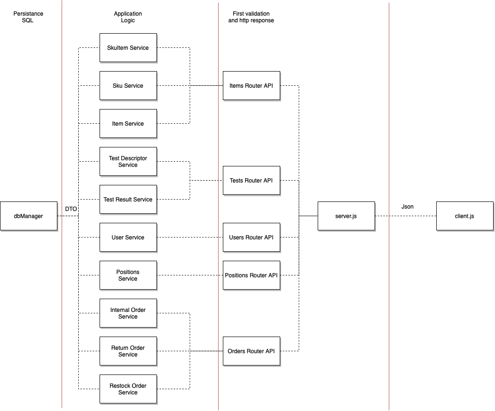

# Integration and API Test Report

Date: 25/05/2022

Version: 0.9

# Contents

- [Integration and API Test Report](#integration-and-api-test-report)
- [Contents](#contents)
- [Dependency graph](#dependency-graph)
- [Integration approach](#integration-approach)
- [Integration Tests](#integration-tests)
  - [Step 1 - Unit testing dbManager with real db by Jest (A)](#step-1---unit-testing-dbmanager-with-real-db-by-jest-a)
  - [Step 2 - Unit testing Services with mock db by Jest (B)](#step-2---unit-testing-services-with-mock-db-by-jest-b)
  - [Step 3 - API testing with Mocha and Chai (A+B+C)](#step-3---api-testing-with-mocha-and-chai-abc)
- [Coverage of Scenarios and FR](#coverage-of-scenarios-and-fr)
- [Coverage of Non Functional Requirements](#coverage-of-non-functional-requirements)
    - 

- [Tests](#tests)

- [Scenarios](#scenarios)

- [Coverage of scenarios and FR](#scenario-coverage)
- [Coverage of non-functional requirements](#nfr-coverage)

# Dependency graph 

     
# Integration approach

We followed the bottom up integration sequence.
First of all we tested dbManager and Services classes as Unit with Jest.

*For dbManager we used the real database, for Services we used the mock database to remove the dependency on the database.*

Then we did API testing with Mocha and Chai. In this phase we tested also services classes with real interaction with dbManager.

In summary this is the sequence we followed:

1.  STEP 1: Unit testing dbManager with real db by Jest (A)
2.  STEP 2: Unit testing Services with mock db by Jest (B)
3.  STEP 3: API testing with Mocha and Chai (A+B+C), *where C is the route functions*

#  Integration Tests

Jest test cases are in the folder code/server/unit_test
Integration test cases are in the folder code/server/test
*The first two steps correspond to unit testing presented in UnitTestReport.md*

## Step 1 - Unit testing dbManager with real db by Jest (A)

The db used for testing is code/server/db/EZWHDB.sqlite

| Classes   | Jest test groups                                    |
| --------- | --------------------------------------------------- |
| DBManager | [DB] restock orders GET functions                   |
|           | [DB] restock orders CREATE UPDATE DELETE functions  |
|           | [DB] restock model return checkers                  |
|           | [DB] return orders functions                        |
|           | [DB] internal orders GET functions                  |
|           | [DB] internal orders CREATE UPDATE DELETE functions |
|           | [DB] test descriptor GET functions                  |
|           | [DB] test descriptor CREATE UPDATE DELETE functions |
|           | [DB] test result GET functions                      |
|           | [DB] test result CREATE UPDATE DELETE functions     |
|           | [DB] user GET functions                             |
|           | [DB] user CREATE UPDATE DELETE functions            |
|           | [DB] position functions                             |
|           | [DB] get occupied capacities of a position          |
|           | [DB] sku functions                                  |
|           | [DB] SkuItems functions                             |
|           | [DB] Items functions                                |
|           | [DB] close db and testing functions                 |

*Single test names are in the UnitTestReport*

## Step 2 - Unit testing Services with mock db by Jest (B)
| Classes               | mock up used                           | Jest test groups                   |
| --------------------- | -------------------------------------- | ---------------------------------- |
| InternalOrderService  | code/server/unit_test/mockDbManager.js | get internal orders                |
|                       | code/server/unit_test/mockDbManager.js | create edit delete internal orders |
|                       | code/server/unit_test/mockDbManager.js | specific internal order errors     |
| RestockOrderService   | code/server/unit_test/mockDbManager.js | get restock orders                 |
|                       | code/server/unit_test/mockDbManager.js | create restock order               |
|                       | code/server/unit_test/mockDbManager.js | update restock order               |
|                       | code/server/unit_test/mockDbManager.js | delete restock order               |
| ReturnOrderService    | code/server/unit_test/mockDbManager.js | get return orders                  |
|                       | code/server/unit_test/mockDbManager.js | create return order                |
|                       | code/server/unit_test/mockDbManager.js | delete return order                |
| TestDescriptorService | code/server/unit_test/mockDbManager.js | get all test descriptors           |
|                       | code/server/unit_test/mockDbManager.js | get test descriptor by id          |
|                       | code/server/unit_test/mockDbManager.js | create test descriptor             |
|                       | code/server/unit_test/mockDbManager.js | update test descriptor             |
|                       | code/server/unit_test/mockDbManager.js | delete test descriptor             |
| TestResultService     | code/server/unit_test/mockDbManager.js | get test results of skuItem        |
|                       | code/server/unit_test/mockDbManager.js | get test result                    |
|                       | code/server/unit_test/mockDbManager.js | create test result                 |
|                       | code/server/unit_test/mockDbManager.js | update test result                 |
|                       | code/server/unit_test/mockDbManager.js | delete test result                 |
| UserService           | code/server/unit_test/mockDbManager.js | get  user info                     |
|                       | code/server/unit_test/mockDbManager.js | get all suppliers                  |
|                       | code/server/unit_test/mockDbManager.js | get all users                      |
|                       | code/server/unit_test/mockDbManager.js | create new user                    |
|                       | code/server/unit_test/mockDbManager.js | login                              |
|                       | code/server/unit_test/mockDbManager.js | logout                             |
|                       | code/server/unit_test/mockDbManager.js | update user rights                 |
|                       | code/server/unit_test/mockDbManager.js | delete user                        |
| SkuService            | code/server/unit_test/mockDbManager.js | get all sku                        |
|                       | code/server/unit_test/mockDbManager.js | get sku by id                      |
|                       | code/server/unit_test/mockDbManager.js | create sku                         |
|                       | code/server/unit_test/mockDbManager.js | update sku                         |
|                       | code/server/unit_test/mockDbManager.js | update sku position                |
|                       | code/server/unit_test/mockDbManager.js | delete sku                         |
|                       | code/server/unit_test/mockDbManager.js | update sku forcing 503             |
| SkuItemService        | code/server/unit_test/mockDbManager.js | get all sku items                  |
|                       | code/server/unit_test/mockDbManager.js | get sku items of skuid             |
|                       | code/server/unit_test/mockDbManager.js | get sku item                       |
|                       | code/server/unit_test/mockDbManager.js | create skuItem                     |
|                       | code/server/unit_test/mockDbManager.js | update skuItem                     |
|                       | code/server/unit_test/mockDbManager.js | delete skuItem                     |
| PositionService       | code/server/unit_test/mockDbManager.js | get all positions                  |
|                       | code/server/unit_test/mockDbManager.js | create position                    |
|                       | code/server/unit_test/mockDbManager.js | update position                    |
|                       | code/server/unit_test/mockDbManager.js | update position id                 |
|                       | code/server/unit_test/mockDbManager.js | delete position                    |
| ItemService           | code/server/unit_test/mockDbManager.js | get all items                      |
|                       | code/server/unit_test/mockDbManager.js | get item by id                     |
|                       | code/server/unit_test/mockDbManager.js | create item                        |
|                       | code/server/unit_test/mockDbManager.js | update item                        |
|                       | code/server/unit_test/mockDbManager.js | delete item                        |

*Single test names are in the UnitTestReport*

## Step 3 - API testing with Mocha and Chai (A+B+C)

   
| Classes        | Test                      |
| -------------- | ------------------------- |
| RestockOrder   | test restock order apis   |
| ReturnOrder    | test return order apis    |
| InternalOrder  | test internal order apis  |
| Position       | test position apis        |
| TestDescriptor | test test descriptor apis |

# Coverage of Scenarios and FR

<Report in the following table the coverage of  scenarios (from official requirements and from above) vs FR. 
Report also for each of the scenarios the (one or more) API Mocha tests that cover it. >  Mocha test cases should be here code/server/test

| Scenario ID | Functional Requirements covered | Mocha  Test(s) |
| ----------- | ------------------------------- | -------------- |
| ..          | FRx                             |                |
| ..          | FRy                             |                |
| ...         |                                 |                |
| ...         |                                 |                |
| ...         |                                 |                |
| ...         |                                 |                |

# Coverage of Non Functional Requirements

<Report in the following table the coverage of the Non Functional Requirements of the application - only those that can be tested with automated testing frameworks.>

### 

| Non Functional Requirement | Test name |
| -------------------------- | --------- |
|                            |           |

