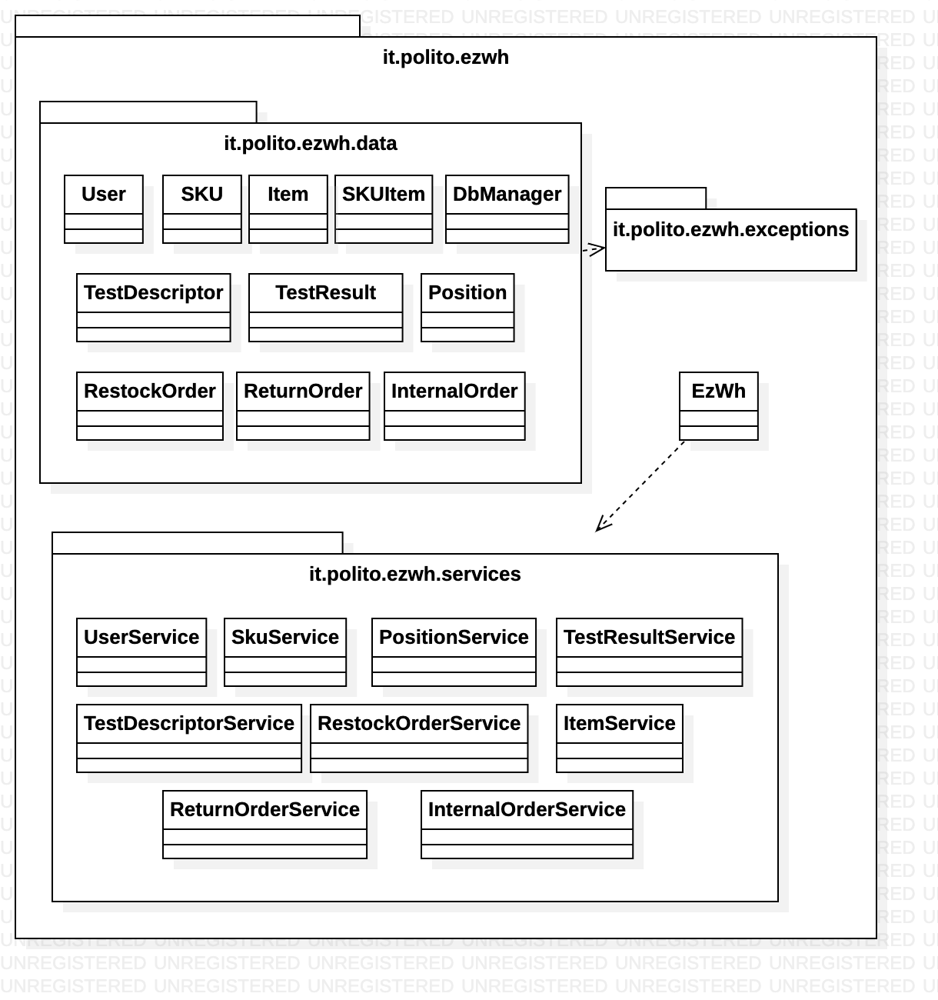
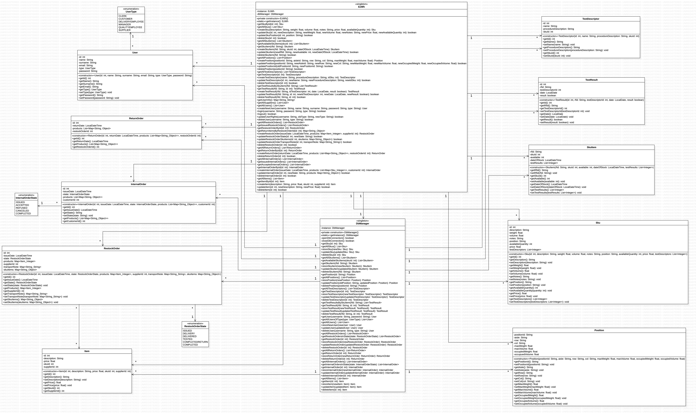
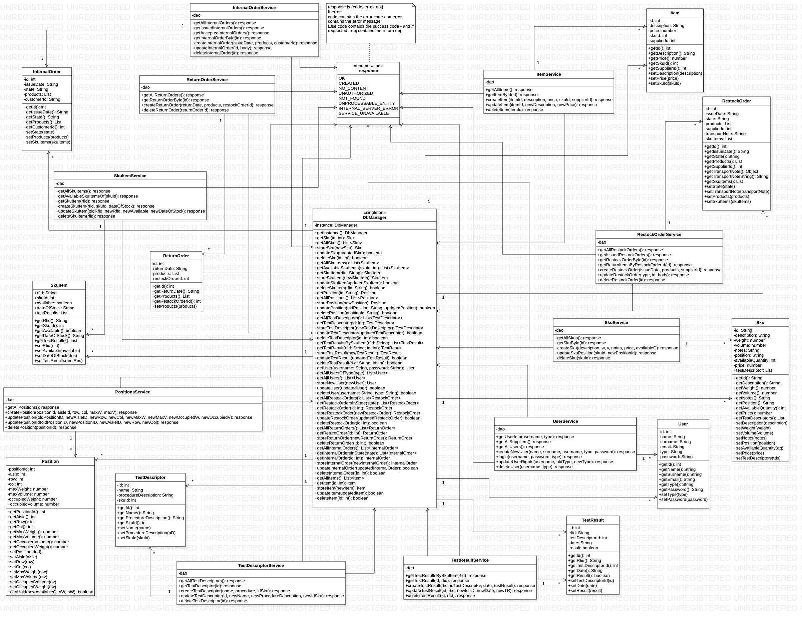

# Design Document 

Authors: Samuele Lo Truglio, Mario Mastrandrea, Kristi Gjerko

Last-modified date: 20/06/2022

Version: 1.1

| Version Number | Description                                                                                                 |
| :------------: | :---------------------------------------------------------------------------------------------------------- |
|      0.1       | Initial version                                                                                             |
|      0.2       | Added high level diagram and description, added verification matrix based on internal draft of design model |
|      0.3       | Added verification sequence diagrams                                                                        |
|      0.35      | Updated verification sequence diagrams                                                                      |
|      0.4       | Added low level class diagram                                                                               |
|      0.5       | Final design diagrams: high-level and low-level                                                             |
|      0.6       | Fixed verification sequence diagrams                                                                        |
|      1.0       | Final version                                                                                               |
|      1.1       | Added change 1 params                                                                                        |

# Contents

- [Design Document](#design-document)
- [Contents](#contents)
- [Instructions](#instructions)
- [High level design](#high-level-design)
- [Low level design](#low-level-design)
    - [UPDATE:](#update)
    - [UPDATE2 CHANGE1](#update2-change1)
- [Verification traceability matrix](#verification-traceability-matrix)
- [Verification sequence diagrams](#verification-sequence-diagrams)

# Instructions

The design must satisfy the Official Requirements document, notably functional and non functional requirements, and be consistent with the APIs

# High level design 
The proposed architecture for EzWh software is based on the high level **layered** design. 

The high level design is composed by a set of **layers**: *GUI (front-end), Application Logic and Data(DB)*

The application is composed of a main package and a set of subpackages, described by the following bulleted list:

* it.polito.ezwh (the main package) contains the main application, in particular the façade
* it.polito.ezwh.data contains the data structures used by the application and the database access
* it.polito.ezwh.service contains the services used by the application
* it.polito.ezwh.exceptions contains the code used by the application to handle exceptions triggered by the user

The EzWh application follows the **MVC** (Model-View-Controller) architectural pattern consisting of:
- Model -> all the classes in *data* subpackage where are represented the data structures
- View -> GUI (front-end)
- Controller -> *EzWh* - the class exposing the APIs of the app back-end, that performs interaction on the data objects through *services classes* and manages user inputs from the *View*.

Note that GUI is not part of the *EzWh* package, but it is **a separate project**, so that can be developed independently of the *EzWh* package out of the *EzWh* repository. 

# Low level design
In the following diagram, the classes of the high level design are exploded in the low level design.

The *EzWh* class represents the **façade** of the application and is implemented as a **Singleton** instance.

The *DbManager* class complies with **Repository Pattern**, so it represents the unique access point to all the persistent data managed by the application and it is the only one interacting with the Database. It is implemented as a **Singleton** instance too.

*All data types (class attributes, method parameters and method return types) refers to Java primitive types or Java main classes, and are expressed according to Java language conventions. Regarding the collections we used interfaces like List instead of specific classes in order to increase the level of abstraction and give to developers the possibility of choosing the best implementation*

### UPDATE:
In the following diagram the *EzWh class* is split in all the services that it implements, to better understand low level interactions.

*Data types have been omitted because of in Javascript they are not necessary, and the code is more readable. Constructor methods have been omitted too for the previous reason*

### UPDATE2 CHANGE1

**CHANGE 1** changes the way to think item with his item id and sku id that now are strictly unique only to the supplier. In our case this new constraint is not a problem because relationships between classes don't change, we have only to change their representation in the database.

# Verification traceability matrix

|  FR   |  Sku  | SkuItem | Position | TestDescriptor | TestResult | User  | RestockOrder | ReturnOrder | InternalOrder | Item  | EzWh  | DbManager |
| :---: | :---: | :-----: | :------: | :------------: | :--------: | :---: | :----------: | :---------: | :-----------: | :---: | :---: | :-------: |
|  FR1  |       |         |          |                |            |   X   |              |             |               |       |   X   |     X     |
|  FR2  |   X   |         |          |                |            |       |              |             |               |       |   X   |     X     |
|  FR3  |       |         |    X     |       X        |     X      |       |              |             |               |       |   X   |     X     |
|  FR4  |       |         |          |                |            |   X   |              |             |               |       |   X   |     X     |
|  FR5  |   X   |    X    |          |                |     X      |   X   |      X       |      X      |               |       |   X   |     X     |
|  FR6  |   X   |    X    |          |                |            |       |              |             |       X       |       |   X   |     X     |
|  FR7  |       |         |          |                |            |       |              |             |               |   X   |   X   |     X     |

# Verification sequence diagrams 

