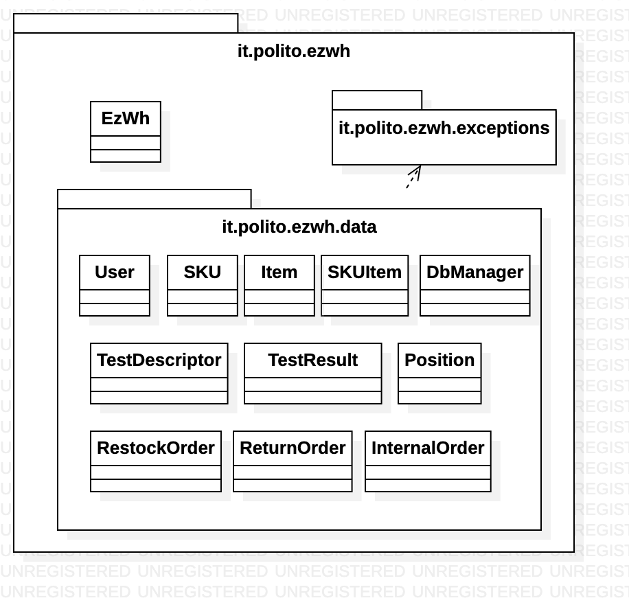

# Design Document 

Authors: Samuele Lo Truglio, Mario Mastrandrea, Kristi Gjerko

Date:

Version: 0.2
| Version Number | Description |
| :------------: | :---------- |
| 0.1 | Initial version |
| 0.2 | Added high level diagram and description, added verification matrix based on internal draft of design model  |
|0.3|Added verification sequence diagrams|

# Contents

- [Design Document](#design-document)
- [Contents](#contents)
- [Instructions](#instructions)
- [High level design](#high-level-design)
- [Low level design](#low-level-design)
- [Verification traceability matrix](#verification-traceability-matrix)
- [Verification sequence diagrams](#verification-sequence-diagrams)

# Instructions

The design must satisfy the Official Requirements document, notably functional and non functional requirements, and be consistent with the APIs

# High level design 
The proposed architecture for EzWh software is based on the high level layered design. 

The high level design is composed by a set of layers, each one of them representing a different level of abstraction.

The application is composed of a main package and a set of subpackages, described by the following bulleted list:

* it.polito.ezwh (the main package) contains the main application
* it.polito.ezwh.gui contains the graphical user interface
* it.polito.ezwh.data contains the data structures
* it.polito.ezwh.exceptions contains the code used by the application to handle exceptions triggered by the user

# Low level design
In the following diagram, the classes of the high level design are exploded in the low level design.

The EzWh class represents the facade of the application.

<for each package in high level design, report class diagram. Each class should detail attributes and operations>

# Verification traceability matrix
|  FR   |  SKU  | SKUItem | Position | TestDescriptor | TestResult | User  | RestockOrder | ReturnOrder | InternalOrder | Item  | EzWh  |
| :---: | :---: | :-----: | :------: | :------------: | :--------: | :---: | :----------: | :---------: | :-----------: | :---: | :---: |
|  FR1  |       |         |          |                |            |    X   |              |             |               |       |    X   |
|  FR2  |    X   |         |          |                |            |       |              |             |               |       |    X   |
|  FR3  |       |         |     X     |         X       |      X      |       |              |             |               |       |    X   |
|  FR4  |       |         |          |                |            |   X    |              |             |               |       |    X   |
|  FR5  |   X    |    X     |          |                |    X        |   X    |       X       |     X        |               |       |   X    |
|  FR6  |   X    |   X      |          |                |            |       |              |             |         X      |       |   X    |
|  FR7  |       |         |          |                |            |       |              |             |               |    X   |    X   |

# Verification sequence diagrams 

