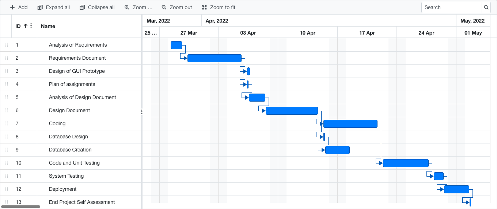

# Project Estimation  
Authors: Samuele Lo Truglio, Mario Mastrandrea, Kristi Gjerko, Alessandro Migliardi

Date: 06/04/2021

Version: 0.0

# Estimation approach
In this project we used three different approaches to estimate effort and duraction of the project.
At the end of the document we will have a table with the results of the estimation.
## Estimate by size
### 
|                                                                                                         |             Estimate |
| ------------------------------------------------------------------------------------------------------- | -------------------: |
| NC =  Estimated number of classes to be developed                                                       |                   10 |
| A = Estimated average size per class, in LOC                                                            |              200 LOC |
| S = Estimated size of project, in LOC (= NC * A)                                                        |             2000 LOC |
| E = Estimated effort, in person hours (here use productivity 10 LOC per person hour)                    |               200 PH |
| C = Estimated cost, in euro (here use 1 person hour cost = 30 euro)                                     |                6000€ |
| Estimated calendar time, in calendar weeks (Assume team of 4 people, 8 hours per day, 5 days per week ) | 200/(4*8)= 6.25 days |

## Estimate by product decomposition
### 
| component name       | Estimated effort (person hours) |
| -------------------- | ------------------------------: |
| requirement document |                              52 |
| GUI prototype        |                               8 |
| design document      |                              40 |
| code                 |                              52 |
| unit tests           |                              24 |
| api tests            |                              20 |
| management documents |                              12 |
| **Total**            |                             224 |

## Estimate by activity decomposition
### 
| Activity name               | Estimated effort (person hours) |
| --------------------------- | ------------------------------: |
| Analysis of requirements    |                              16 |
| Requirements document       |                              40 |
| Design of GUI prototype     |                               8 |
| Plan of assignments         |                               4 |
| Analysis of design document |                              16 |
| Design document             |                              36 |
| Coding                      |                              40 |
| Database design             |                               4 |
| Database creation           |                               6 |
| Code and Unit Testing       |                              32 |
| System Testing              |                              12 |
| Deployment                  |                               8 |
| End project self assessment |                               4 |
| **Total**                   |                             226 |
### Gantt Diagram

*This diagram has been generated by <a href="https://www.onlinegantt.com">Online Gantt</a>*

# Summary

|                                    | Estimated effort | Estimated duration |
| ---------------------------------- | ---------------: | -----------------: |
| estimate by size                   |            200PH |          6.25 days |
| estimate by product decomposition  |            208PH |          6.50 days |
| estimate by activity decomposition |            224PH |          ~ 1 month |

Comparing results we can see that the estimated effort is similar for the three techniques, but the estimated duration is different. The estimated duration is much longer for the activity decomposition technique. This is because the estimated duration is calculated by the number of days in the project, and the number of days in the project is much longer than the number of days in the size estimation. 