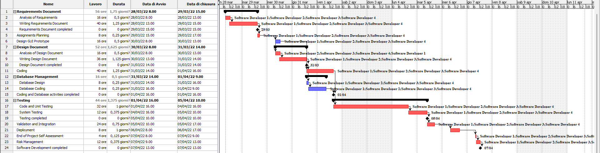

# Project Estimation  
Authors: Samuele Lo Truglio, Mario Mastrandrea, Kristi Gjerko

Last Update: 12/04/2022
Date: 06/04/2022

Version: 1.0

# Estimation approach
In this project we used three different approaches to estimate effort and duration of the project.
At the end of the document we will have a table with the results of the estimation.

## Estimate by size
### 
|                                                                                                         |              Estimate |
| ------------------------------------------------------------------------------------------------------- | --------------------: |
| NC =  Estimated number of classes to be developed                                                       |                    15 |
| A = Estimated average size per class, in LOC                                                            |               200 LOC |
| S = Estimated size of project, in LOC (= NC * A)                                                        |              3000 LOC |
| E = Estimated effort, in person hours (here use productivity 10 LOC per person hour)                    |                300 PH |
| C = Estimated cost, in euro (here use 1 person hour cost = 30 euro)                                     |                 9000€ |
| Estimated calendar time, in calendar weeks (Assume team of 4 people, 8 hours per day, 5 days per week ) | 200/(4*8)= 9.375 days |

## Estimate by product decomposition
### 
| component name       | Estimated effort (person hours) |
| -------------------- | ------------------------------: |
| requirement document |                              65 |
| GUI prototype        |                              14 |
| design document      |                              51 |
| code                 |                              68 |
| unit tests           |                              30 |
| api tests            |                              20 |
| management documents |                              13 |
| **Total**            |                             261 |
*This estimation has been obtained applying Delphi technique*

## Estimate by activity decomposition
### 
| Activity name               | Estimated effort (person hours) |
| --------------------------- | ------------------------------: |
| Analysis of requirements    |                              16 |
| Requirements document       |                              40 |
| Design of GUI prototype     |                              16 |
| Plan of assignments         |                               8 |
| Analysis of design document |                              16 |
| Design document             |                              36 |
| Coding                      |                              40 |
| Database design             |                               8 |
| Database creation           |                               8 |
| Code and Unit Testing       |                              32 |
| System Testing              |                              12 |
| Validation and Integration  |                              24 |
| Deployment                  |                               8 |
| End project self assessment |                               4 |
| Risk Management             |                              12 |
| **Total**                   |                             280 |

### Gantt Diagram

*This diagram has been captured from the application ProjectLibre*

# Summary

|                                    | Estimated effort |          Estimated duration |
| ---------------------------------- | ---------------: | --------------------------: |
| estimate by size                   |            300PH |                  9.375 days |
| estimate by product decomposition  |            261PH |                   8.16 days |
| estimate by activity decomposition |            280PH | 8.75 days (11 calendar days) |

The estimation results are different because they are based on different approaches. In our opinion the estimation by size is the most accurate one because it is based on the size of the project. Other approaches are based on personal experience and knowledge and they are not always accurate.