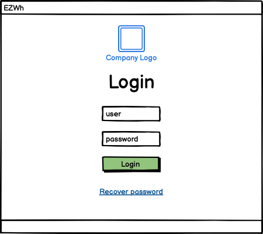

# Graphical User Interface Prototype  

Authors: Samuele Lo Truglio, Mario Mastrandrea, Kristi Gjerko, Alessandro Migliardi

Date: 07/04/2022

Version: 0.1

\<Report here the GUI that you propose. You are free to organize it as you prefer. A suggested presentation matches the Use cases and scenarios defined in the Requirement document. The GUI can be shown as a sequence of graphical files (jpg, png)  >

## Contents
- [Graphical User Interface Prototype](#graphical-user-interface-prototype)
  - [Contents](#contents)
    - [How to read](#how-to-read)
  - [Autenthication](#autenthication)
    - [Login](#login)
  - [Admin / Manager View](#admin--manager-view)
    - [Homepage](#homepage)
    - [Manage Users](#manage-users)
    - [Manage Suppliers](#manage-suppliers)
    - [Manage Inventory](#manage-inventory)
    - [Manage Catalogue](#manage-catalogue)
    - [Manage Warehouse Structure](#manage-warehouse-structure)
    - [External Orders](#external-orders)
    - [Internal Orders](#internal-orders)
  - [Quality Office View](#quality-office-view)
    - [Homepage](#homepage-1)
  - [OU View](#ou-view)
    - [Homepage](#homepage-2)
    - [Orders List](#orders-list)
    - [New Order](#new-order)
  - [WH Worker View](#wh-worker-view)
    - [Homepage](#homepage-3)
    - [Scan Item](#scan-item)
    - [Move Item](#move-item)

### How to read
The GUI is composed of five main parts and a few sub-parts. The purpose of these parts is to provide a clear way to navigate the system. 

## Autenthication
### Login

Recover password

## Admin / Manager View
### Homepage

### Manage Users

Edit/Add User (template is the same)

### Manage Suppliers

Edit/Add Supplier (template is the same)

### Manage Inventory

### Manage Catalogue

Edit/Add Item (template is the same)

### Manage Warehouse Structure

Add Structure Space

Edit Structure Space

### External Orders

Place new order

### Internal Orders

## Quality Office View
### Homepage

After click on a order

Outcome

## OU View
### Homepage

### Orders List

### New Order

Order basket

## WH Worker View
### Homepage

### Scan Item

### Move Item
After scanning you see where to put the item

Edit final position of item

Move to pickup area for ou orders

