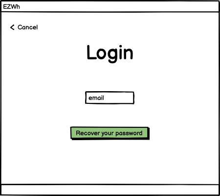
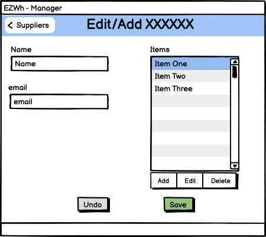
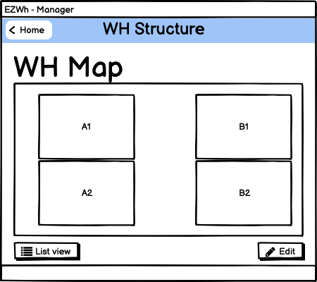
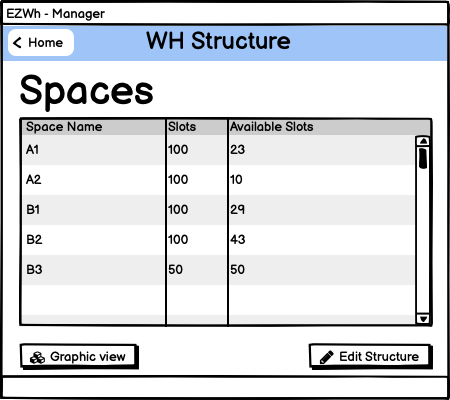
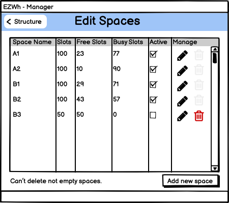
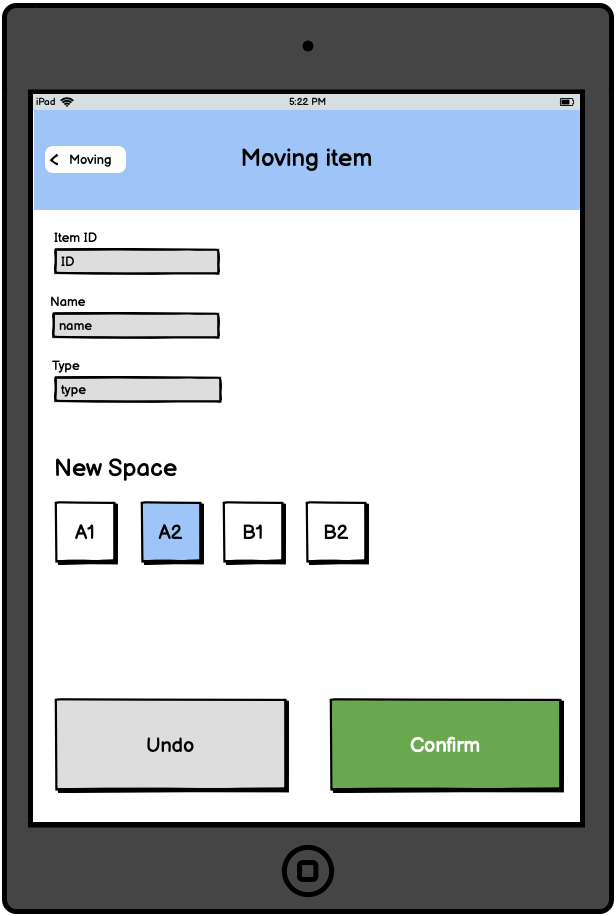
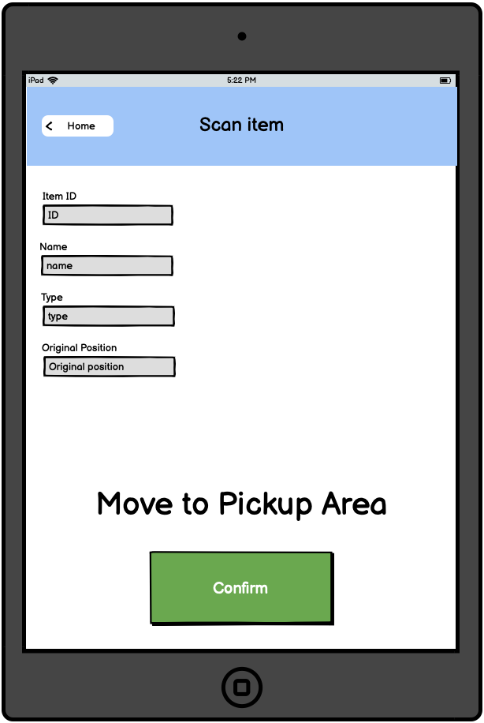

# Graphical User Interface Prototype  
Authors: Samuele Lo Truglio, Mario Mastrandrea, Kristi Gjerko

Last Update: 12/04/2022

Date: 10/04/2022

Version: 1.0

## Contents
- [Graphical User Interface Prototype](#graphical-user-interface-prototype)
  - [Contents](#contents)
    - [How to read](#how-to-read)
  - [Shared Interfaces](#shared-interfaces)
    - [Login](#login)
      - [Recover password](#recover-password)
      - [My profile](#my-profile)
      - [My profile edit](#my-profile-edit)
  - [IT Admin / Manager View](#it-admin--manager-view)
    - [Homepage](#homepage)
    - [Manage Users](#manage-users)
      - [Edit/Add User (template is the same)](#editadd-user-template-is-the-same)
    - [Manage Suppliers](#manage-suppliers)
      - [Edit/Add Supplier (template is the same)](#editadd-supplier-template-is-the-same)
    - [Manage Inventory](#manage-inventory)
    - [Manage Catalogue](#manage-catalogue)
      - [Edit/Add Item (template is the same)](#editadd-item-template-is-the-same)
    - [Manage Warehouse Structure](#manage-warehouse-structure)
      - [WH Spaces - map view](#wh-spaces---map-view)
        - [WH Spaces - list view](#wh-spaces---list-view)
      - [WH Spaces - edit view](#wh-spaces---edit-view)
      - [Add Structure Space](#add-structure-space)
      - [Edit Structure Space](#edit-structure-space)
    - [External Orders](#external-orders)
      - [Place new order](#place-new-order)
    - [Internal Orders](#internal-orders)
  - [Quality Office View](#quality-office-view)
    - [Homepage](#homepage-1)
      - [After click on a order](#after-click-on-a-order)
      - [Outcome](#outcome)
  - [OU View](#ou-view)
    - [Homepage](#homepage-2)
    - [Orders List](#orders-list)
    - [New Order](#new-order)
      - [Order basket](#order-basket)
  - [WH Worker View](#wh-worker-view)
    - [Homepage](#homepage-3)
    - [Scan Item](#scan-item)
    - [Move Item](#move-item)
      - [Edit final position of item](#edit-final-position-of-item)
      - [Move to pickup area for ou orders](#move-to-pickup-area-for-ou-orders)
  - [Notes](#notes)

### How to read
The GUI is composed of five main parts and a few sub-parts. The purpose of these parts is to provide a clear way to navigate the system. 

## Shared Interfaces
Interfaces shared between different users

### Login

#### Recover password

#### My profile

#### My profile edit

## IT Admin / Manager View
### Homepage

*In WH Manager homepage there aren't CRUD options*
### Manage Users

#### Edit/Add User (template is the same)

### Manage Suppliers

#### Edit/Add Supplier (template is the same)

### Manage Inventory

### Manage Catalogue

#### Edit/Add Item (template is the same)

### Manage Warehouse Structure
#### WH Spaces - map view

##### WH Spaces - list view

#### WH Spaces - edit view

*Delete icon become clickable only if there are no items inside (0 busy slots)*

#### Add Structure Space

*You can decide to not make active a space on adding. This feature could be useful in case of you first create a space on the software and then you let the physical space ready to store items*

*Different look for already assigned spaces on virtual map*

#### Edit Structure Space

*When you edit the position of an existing space you can see his position and other already assigned spaces*

### External Orders

#### Place new order

*You can see maximum quantity that you can order*

### Internal Orders

## Quality Office View

### Homepage

#### After click on a order

#### Outcome

## OU View

### Homepage

### Orders List

### New Order

#### Order basket

## WH Worker View
These interfaces have big buttons to facilitate warehouse workers actions due to touchscreen sensibility of common tablets.

### Homepage

### Scan Item

### Move Item
After scanning you see where to put the item

*In some circumstances the suggested final space can be unexpectedly unavailable, so the warehouse worker is able to edit this information*

#### Edit final position of item

#### Move to pickup area for ou orders

## Notes
In our system all users will use the software on a PC, except for the Warehouse Worker.
