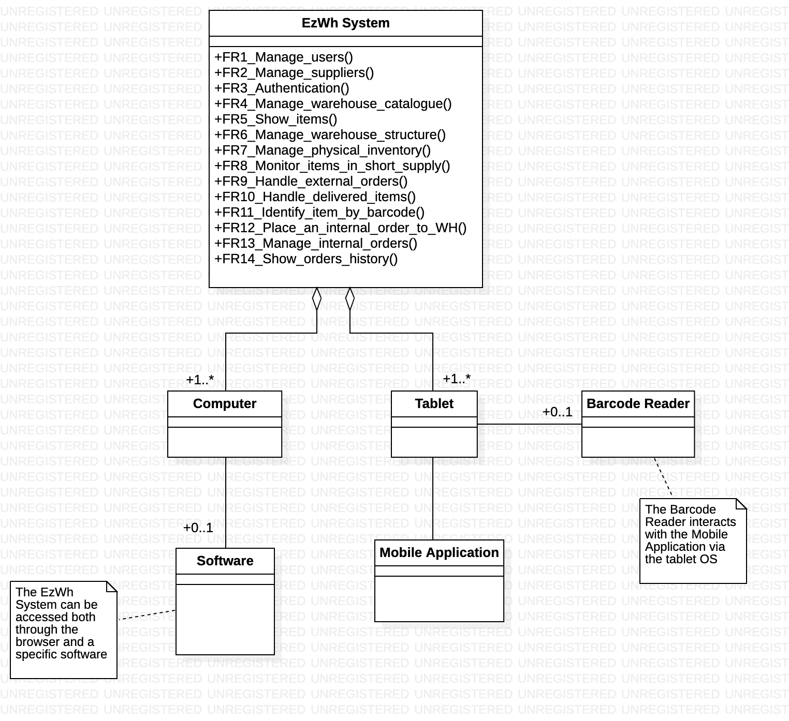
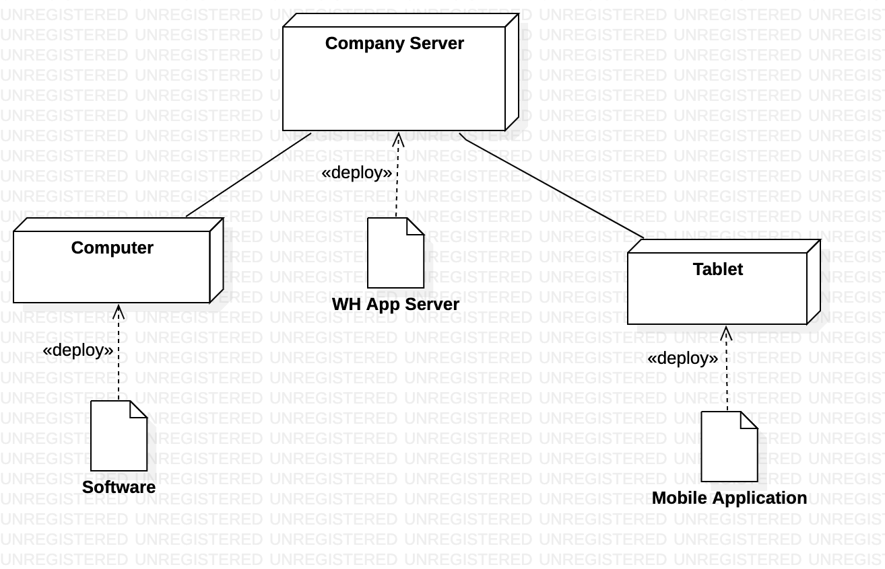

# Requirements Document 
Last-Modified: 9 april 2022
Date: 22 march 2022

Version: 0.8

 
| Version number | Change                                     |
| -------------- | :----------------------------------------- |
| 0.1            | added stakeholders                         |
| 0.2            | context diagram, functional req            |
| 0.3            | fr, nfr req                                |
| 0.4            | modified context diagram and actors        |
| 0.5            | Personas, Stories, added NFRs, modified FR |
| 0.6            | Added Gantt diagram and Estimation         |
| 0.7            | Added use cases and scenarios              |
| 0.8            | Added System Design and Deployment Diagram |

# Contents

- [Requirements Document](#requirements-document)
- [Contents](#contents)
- [Informal description](#informal-description)
- [Stakeholders](#stakeholders)
- [Context Diagram and interfaces](#context-diagram-and-interfaces)
  - [Context Diagram](#context-diagram)
  - [Interfaces](#interfaces)
- [Stories and personas](#stories-and-personas)
  - [Personas](#personas)
  - [Stories](#stories)
- [Functional and non functional requirements](#functional-and-non-functional-requirements)
  - [Functional Requirements](#functional-requirements)
  - [Non Functional Requirements](#non-functional-requirements)
- [Use case diagram and use cases](#use-case-diagram-and-use-cases)
  - [Use case diagram](#use-case-diagram)
    - [Use case 1, UC1](#use-case-1-uc1)
        - [Scenario 1.1](#scenario-11)
        - [Scenario 1.2](#scenario-12)
        - [Scenario 1.x](#scenario-1x)
    - [Use case 2, UC2](#use-case-2-uc2)
    - [Use case x, UCx](#use-case-x-ucx)
- [Glossary](#glossary)
- [System Design](#system-design)
- [Deployment Diagram](#deployment-diagram)

# Informal description

Medium companies and retailers need a simple application to manage the relationship with suppliers and the inventory of physical items stocked in a physical warehouse. 
The warehouse is supervised by a manager, who supervises the availability of items. When a certain item is in short supply, the manager issues an order to a supplier. In general the same item can be purchased by many suppliers. The warehouse keeps a list of possible suppliers per item. 

After some time the items ordered to a supplier are received. The items must be quality checked and stored in specific positions in the warehouse. The quality check is performed by specific roles (quality office), who apply specific tests for item (different items are tested differently). Possibly the tests are not made at all, or made randomly on some of the items received. If an item does not pass a quality test it may be rejected and sent back to the supplier. 

Storage of items in the warehouse must take into account the availability of physical space in the warehouse. Further the position of items must be traced to guide later recollection of them.

The warehouse is part of a company. Other organizational units (OU) of the company may ask for items in the warehouse. This is implemented via internal orders, received by the warehouse. Upon reception of an internal order the warehouse must collect the requested item(s), prepare them and deliver them to a pick up area. When the item is collected by the other OU the internal order is completed. 

EZWH (EaSy WareHouse) is a software application to support the management of a warehouse.

# Stakeholders

| Stakeholder name    | Description                                                         |
| ------------------- | ------------------------------------------------------------------- |
| Company             | Takes business decisions regarding the use of the application       |
| Organizational Unit | Requests internal orders by means of the application                |
| OU executive        | OU employee who personally requests internal orders                 |
| Warehouse manager   | Supervises the availability of items and issues orders to suppliers |
| Warehouse worker    | Deals with physical items in the warehouse                          |
| Quality office      | In charge of quality testing on new arrived items                   |
| Supplier            | Provides items to the warehouse                                     |
| Software house      | Develops, updates and maintains the software system                 |
| IT administrator    | Manages users and daily functioning of the application              |
| Security manager    | Supervises the security of the company's IT infrastructure          |
| DB manager          | In charge of the DBMS                                               |
| DBMS                | DataBase Management System used by the company                      |
| Payment Service     | Manages payments to suppliers                                       |
| Shipping company    | In charge of delivering items                                       |

# Context Diagram and interfaces

## Context Diagram

## Interfaces

| Actor            | Logical Interface |      Physical Interface |
| ---------------- | :---------------: | ----------------------: |
| WH Manager       |        GUI        | Screen, Keyboard, Mouse |
| WH Worker        |        GUI        |                  Screen |
| -                | Scan Item Command |         Barcode scanner |
| QO Employee      |        GUI        | Screen, Keyboard, Mouse |
| OU Executive     |        GUI        | Screen, Keyboard, Mouse |
| IT Administrator |        GUI        | Screen, Keyboard, Mouse |
| Payment Service  |       Data        |      Network Connection |
| Company's DBMS   |       Data        |      Network Connection |
| Supplier         |        GUI        | Screen, Keyboard, Mouse |

# Stories and personas

## Personas

* **Alfred** is a 40 y/o man, he is one of the warehouse workers of a retail furniture company. He has been working for his company for 15 years, so he has a lot of experience in it and he appreciates his job. He is a hard worker, he starts working at 7:00 AM and finishes at 4:00 PM. He is in charge of manage new arrived goods and moving items within the warehouse.

* **Sofia** is 50 y/o and she is a quality office employee of a metallurgical company. She is an Industrial Engineer and she is a very precise and careful person. She deals with arrived external orders, keeps track of all the test information and manages rejected orders.

* **Kathryn** is 30 y/o and she is the warehouse manager of an appliance manufacturing company. She is a curious and very active person. She is responsible for monitoring the availability of items and for the relationships with the suppliers.

* **Quentin** is 25 y/o and he is the marketing executive of a beverage manufacturing company. He just graduated in Business Economics, in fact this is his first working position. He is responsible for collecting requests for items within the Marketing Organizational Unit.

* **Christopher** is 35 y/o and he is the IT Administrator of a pharmaceutical company. He has years of experience in this role, and he is responsible of different systems within his company. Among them, he is in charge of the administration of the company's warehouse system.

* **Martin** is a 60 y/o man, and he is the warehouse manager of a clothing manufacturing company. He has been working there for 20 years, so he has witnessed a progressive growth and development of his company. He is very patient and charismatic. He deals with relations with suppliers but above all with the management of the warehouse structure within the company buildings. 

## Stories
 
* **Alfred** waits for of an external order containing chairs and tables that is going to be delivered. After the delivery he scans each new item with the barcode scanner and uses the EzWh app on his tablet to mark it as delivered.

* **Alfred** goes back to work after the lunch break, and after logging in from his tablet he sees several items that passed the quality tests and need to be positioned in the warehouse. He scans each item with the barcode reader and the app suggests him where it has to be positioned. Some suggested spots are already taken because of an unexpected early delivery, so in those cases he manually inserts an available WH space for the item.  

* **Sofia** logs in into the EzWh app on his Personal Computer and notice that new external orders have been delivered and need to be examined. She and her team decide which of them must be quality tested and she indicates on the app which items skip the test phase. After the tests are made, she inserts a report for each order describing the tests' outcome and indicates if the order is accepted or rejected.

* **Kathryn** has to deal with lots of rejected orders from a supplier of LED components: 5 of the last 10 orders have been rejected due to the failure of the energy efficiency tests. She decides to terminate the relationship with this supplier and replace it with a new one: she logs into the EzWh on her PC, deletes the old supplier from the system and creates a new one, specifying the LED components he is able to supply. Since this new supplier is not able to supply all the necessary components, she get some from another supplier that was already supplying other items to the company. She then adds this new supplier into the corresponding items' list of possible suppliers.

* **Kathryn** starts a new working day and logs into the EzWh app. The system shows her all the items that are in short supply and that need to be ordered again. She then places a new order for each of them, specifying the requested quantity and selecting the supplier she wants to charge for them. After a few hours she receives a phone call from one of the suppliers who warns her that they will not be able to fulfil the requested order. She then decides to edit the corresponding order and select a different supplier for that item. 

* **Quentin** is on his first day of work in the company, so he receives his new credentials (username and password) from the IT Administrator in order to log into EzWh for the first time. He does not like the actual password, so he decides to change it from his portal and choosing a more familiar one, but he must provide a new password that meets all the security requirements too.

* **Quentin** receives lots of mails and phone calls every day from his colleagues, who ask him to provide several different items which are needed within the OU or are running out, such as stationery, PCs for new employees, some additional chairs and some wallpaper for a new marketing campaign. Therefore he logs into the EzWh app, searches for these items within the portal, selects the required quantity for each of them and issues the new internal order to the Warehouse.

* **Christopher** learns of 2 new employees from the HR manager: 1 WH worker and 1 R&D executive. Therefore he logs into the EzWh app on his computer and adds 2 new users to the system, selecting the corresponding privileges for each of them: in fact the two employees will have a different access to the system. He indicates the usernames of the new users and the app provides default secure passwords for them. Christopher then emails the new employees providing them with the new credentials to log into the WH system.

* **Martin** was informed by the company management of the purchase of a new building for the company warehouse in order to contain all the final products of size XXL, so he has to modify the internal representation of the warehouse inventory within the EzWh app. Therefore he logs in and creates a new warehouse space, specifying its capacity. He then searches for these types of items in the app and changes their physical position, moving them to the new WH space.
  

# Functional and non functional requirements

## Functional Requirements

| ID       |                 Description                  |
| -------- | :------------------------------------------: |
| **FR1**  |                 Manage users                 |
| FR1.1    |                   Add user                   |
| FR1.2    |                  Edit user                   |
| FR1.3    |                 Delete user                  |
| **FR2**  |               Manage suppliers               |
| FR2.1    |                 Add supplier                 |
| FR2.2    |                Edit supplier                 |
| FR2.3    |               Delete supplier                |
| **FR3**  |                Authentication                |
| FR3.1    |                    Login                     |
| FR3.2    |                    Logout                    |
| FR3.3    |               Recover password               |
| FR3.4    |               Change password                |
| **FR4**  |            Manage items catalogue            |
| FR4.1    |                   Add item                   |
| FR4.2    |                  Edit item                   |
| FR4.3    |                 Delete item                  |
| **FR5**  |                  Show items                  |
| FR5.1    |                  Show by id                  |
| FR5.2    |               Show by features               |
| **FR6**  |          Manage warehouse structure          |
| FR6.1    |           Add new warehouse space            |
| FR6.2    |             Edit warehouse space             |
| FR6.3    |            Delete warehouse space            |
| **FR7**  |          Manage physical inventory           |
| FR7.1    |            Search for item by ID             |
| FR7.2    |         Search for items by features         |
| FR7.3    |        Visualize warehouse inventory         |
| FR7.4    |    Check for available space in warehouse    |
| FR7.5    |         Place new item in a position         |
| FR7.6    |            Change item's position            |
| FR7.7    |          Remove item from position           |
| **FR8**  |        Monitor items in short supply         |
| **FR9**  |            Handle external orders            |
| FR9.1    |       Find possible suppliers per item       |
| FR9.2    |          Create order to a supplier          |
| FR9.3    | Notify payment service about the transaction |
| FR9.4    |     Notify supplier about the new order      |
| FR9.5    |         Change external order status         |
| **FR10** |            Handle delivered items            |
| FR10.1   |       Insert outcome of quality check        |
| FR10.2   |    Notify supplier about a rejected order    |
| FR10.3   |      Suggest position for accepted item      |
| **FR11** |           Identify item by barcode           |
| **FR12** |     Place an internal order to warehouse     |
| **FR13** |            Manage internal orders            |
| FR13.1   |         Change internal order status         |
| FR13.2   |          Show items in pickup area           |
| **FR14** |             Show orders history              |
| FR14.1   |         Show internal orders history         |
| FR14.2   |         Show external orders history         |

## Non Functional Requirements

| ID    |    Type     |                            Description                            | Refers to |
| ----- | :---------: | :---------------------------------------------------------------: | --------: |
| NFR1  | Reliability |                 Availability at least 95% of time                 |   All FRs |
| NFR2  |  Security   |   System must provide safe password to access employees' pages    |       FR1 |
| NFR3  |  Security   |                System must follow GDPR guidelines                 |       FR3 |
| NFR4  |  Usability  | Employee must be able to use the system after 2 hours of training |   All FRs |
| NFR5  |  Usability  |          At most 4 clicks needed to complete each action          |   All FRs |
| NFR6  | Efficiency  |                   Manage up to 2000 item types                    |       FR4 |
| NFR7  | Efficiency  |                    Manage up to 100 employees                     |       FR1 |
| NFR8  | Efficiency  |                    Manage up to 500 suppliers                     |       FR2 |
| NFR9  | Efficiency  |                Manage up to 100k warehouse spaces                 |       FR6 |
| NFR10 | Efficiency  |            Response time to any button pressed <2 sec             |   All FRs |
| NFR11 | Efficiency  |               Support up tp 100 simultaneous users                |   All FRs |
| NFR12 | Portability |             Available for different operating systems             |   All FRs |

# Use case diagram and use cases

## Use case diagram
\<define here UML Use case diagram UCD summarizing all use cases, and their relationships>

\<next describe here each use case in the UCD>
### Use case 1, UC1
| Actors Involved  |                                                                      |
| ---------------- | :------------------------------------------------------------------: |
| Precondition     | \<Boolean expression, must evaluate to true before the UC can start> |
| Post condition   |  \<Boolean expression, must evaluate to true after UC is finished>   |
| Nominal Scenario |         \<Textual description of actions executed by the UC>         |
| Variants         |                      \<other normal executions>                      |
| Exceptions       |                        \<exceptions, errors >                        |

##### Scenario 1.1 

\<describe here scenarios instances of UC1>

\<a scenario is a sequence of steps that corresponds to a particular execution of one use case>

\<a scenario is a more formal description of a story>

\<only relevant scenarios should be described>

| Scenario 1.1   |                                                                            |
| -------------- | :------------------------------------------------------------------------: |
| Precondition   | \<Boolean expression, must evaluate to true before the scenario can start> |
| Post condition |  \<Boolean expression, must evaluate to true after scenario is finished>   |
| Step#          |                                Description                                 |
| 1              |                                                                            |
| 2              |                                                                            |
| ...            |                                                                            |

##### Scenario 1.2

##### Scenario 1.x

### Use case 2, UC2
..

### Use case x, UCx
..

# Glossary

\<use UML class diagram to define important terms, or concepts in the domain of the system, and their relationships> 

\<concepts are used consistently all over the document, ex in use cases, requirements etc>

# System Design

# Deployment Diagram 

