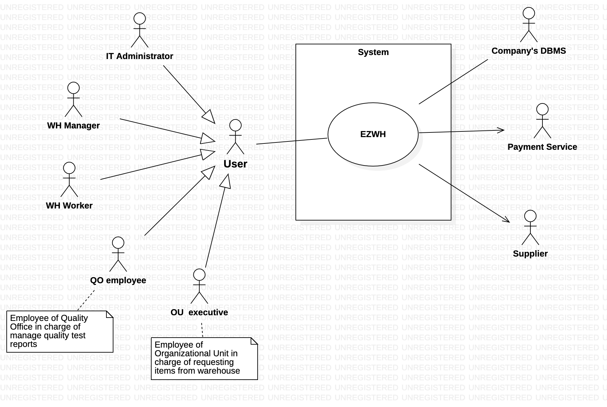
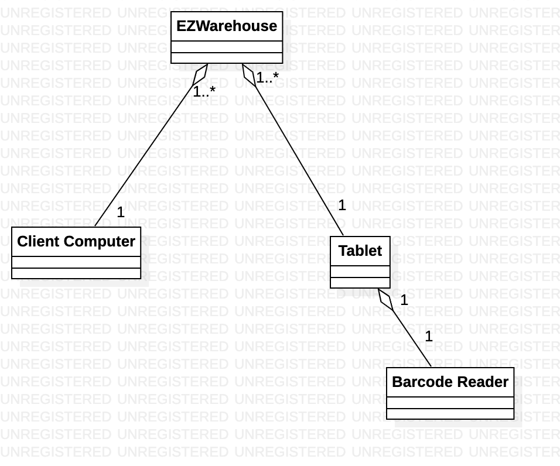
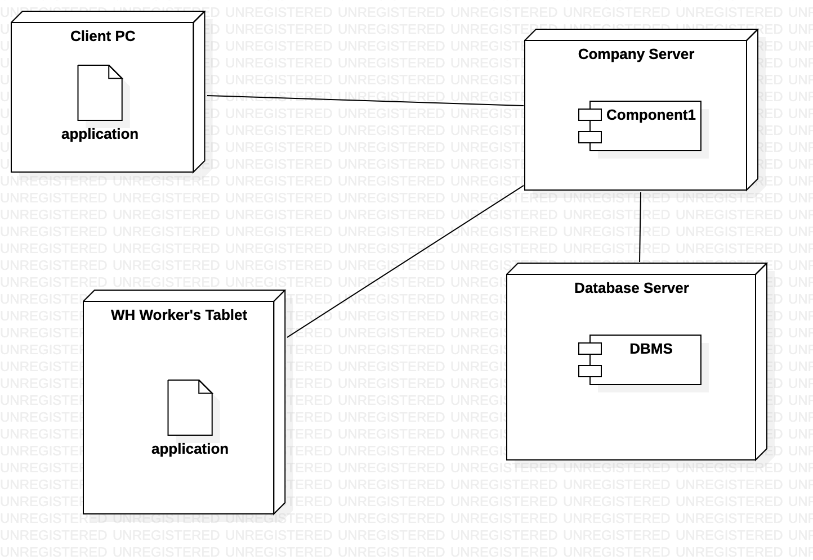

# Requirements Document 
Last-Modified: 8 april 2022
Date: 22 march 2022

Version: 0.5

 
| Version number | Change                                     |
| -------------- | :----------------------------------------- |
| 0.1            | added stakeholders                         |
| 0.2            | context diagram, functional req            |
| 0.3            | fr, nfr req                                |
| 0.4            | modified context diagram and actors        |
| 0.5            | Personas, Stories, added NFRs, modified FR |

# Contents

- [Requirements Document](#requirements-document)
- [Contents](#contents)
- [Informal description](#informal-description)
- [Stakeholders](#stakeholders)
- [Context Diagram and interfaces](#context-diagram-and-interfaces)
  - [Context Diagram](#context-diagram)
  - [Interfaces](#interfaces)
- [Stories and personas](#stories-and-personas)
  - [Personas](#personas)
  - [Stories](#stories)
- [Functional and non functional requirements](#functional-and-non-functional-requirements)
  - [Functional Requirements](#functional-requirements)
  - [Non Functional Requirements](#non-functional-requirements)
- [Use case diagram and use cases](#use-case-diagram-and-use-cases)
  - [Use case diagram](#use-case-diagram)
    - [Use case 1, Log In](#use-case-1-log-in)
        - [Scenario 1.1](#scenario-11)
        - [Scenario 1.2](#scenario-12)
        - [Scenario 1.3](#scenario-13)
        - [Scenario 1.4](#scenario-14)
    - [Use case 2, Log Out](#use-case-2-log-out)
        - [Scenario 2.1](#scenario-21)
    - [Use case 3, Create User Account](#use-case-3-create-user-account)
        - [Scenario 3.1](#scenario-31)
        - [Scenario 3.2](#scenario-32)
    - [Use case 4, Modify User Account](#use-case-4-modify-user-account)
        - [Scenario 4.1](#scenario-41)
        - [Scenario 4.2](#scenario-42)
    - [Use case 5, Delete User Account](#use-case-5-delete-user-account)
        - [Scenario 5.1](#scenario-51)
    - [Use case 6, Insert Supplier](#use-case-6-insert-supplier)
        - [Scenario 6.1](#scenario-61)
        - [Scenario 6.2](#scenario-62)
    - [Use case 7, Modify Supplier](#use-case-7-modify-supplier)
        - [Scenario 7.1](#scenario-71)
        - [Scenario 7.2](#scenario-72)
    - [Use case 8, Delete Supplier](#use-case-8-delete-supplier)
        - [Scenario 8.1](#scenario-81)
    - [Use case 9, Place order to supplier](#use-case-9-place-order-to-supplier)
        - [Scenario 9.1](#scenario-91)
        - [Scenario 9.2](#scenario-92)
        - [Scenario 9.3](#scenario-93)
    - [Use case 10, Read item location](#use-case-10-read-item-location)
        - [Scenario 10.1](#scenario-101)
        - [Scenario 10.2](#scenario-102)
    - [Use case 11, Insert quality test report](#use-case-11-insert-quality-test-report)
        - [Scenario 11.1](#scenario-111)
        - [Scenario 11.2](#scenario-112)
        - [Scenario 11.3](#scenario-113)
    - [Use case 12, Show items in short supply](#use-case-12-show-items-in-short-supply)
        - [Scenario 12.1](#scenario-121)
        - [Scenario 12.2](#scenario-122)
    - [Use case 13, Insert item into catalog](#use-case-13-insert-item-into-catalog)
        - [Scenario 13.1](#scenario-131)
        - [Scenario 13.2](#scenario-132)
    - [Use case 14, Modify item in catalog](#use-case-14-modify-item-in-catalog)
        - [Scenario 14.1](#scenario-141)
        - [Scenario 14.2](#scenario-142)
    - [Use case 15, Delete item from catalog](#use-case-15-delete-item-from-catalog)
        - [Scenario 15.1](#scenario-151)
    - [Use case 16, Link item to supplier](#use-case-16-link-item-to-supplier)
        - [Scenario 16.1](#scenario-161)
    - [Use case 17, Unlink item from supplier](#use-case-17-unlink-item-from-supplier)
        - [Scenario 17.1](#scenario-171)
    - [Use case 18, Configure new warehouse space](#use-case-18-configure-new-warehouse-space)
        - [Scenario 18.1](#scenario-181)
    - [Use case 19, Modify warehouse space](#use-case-19-modify-warehouse-space)
        - [Scenario 19.1](#scenario-191)
    - [Use case 20, Remove warehouse space](#use-case-20-remove-warehouse-space)
        - [Scenario 20.1](#scenario-201)
    - [Use case 21, Change item position](#use-case-21-change-item-position)
        - [Scenario 21.1](#scenario-211)
        - [Scenario 21.2](#scenario-212)
        - [Scenario 21.3](#scenario-213)
        - [Scenario 21.4](#scenario-214)
        - [Scenario 21.5](#scenario-215)
    - [Use case 22, Visualize items to be moved](#use-case-22-visualize-items-to-be-moved)
        - [Scenario 22.1](#scenario-221)
    - [Use case 23, Move item](#use-case-23-move-item)
        - [Scenario 23.1](#scenario-231)
    - [Use case 24, Show warehouse order history](#use-case-24-show-warehouse-order-history)
        - [Scenario 24.1](#scenario-241)
    - [Use case 25, Place internal order to warehouse](#use-case-25-place-internal-order-to-warehouse)
        - [Scenario 25.1](#scenario-251)
        - [Scenario 25.2](#scenario-252)
    - [Use case 26, Show organizational unit order history](#use-case-26-show-organizational-unit-order-history)
        - [Scenario 26.1](#scenario-261)
    - [Use case 27, Fulfill internal order](#use-case-27-fulfill-internal-order)
        - [Scenario 27.1](#scenario-271)
        - [Scenario 27.2](#scenario-272)
    - [Use case 28, Show items in pickup area](#use-case-28-show-items-in-pickup-area)
        - [Scenario 28.1](#scenario-281)
- [Glossary](#glossary)
- [System Design](#system-design)
- [Deployment Diagram](#deployment-diagram)

# Informal description

Medium companies and retailers need a simple application to manage the relationship with suppliers and the inventory of physical items stocked in a physical warehouse. 
The warehouse is supervised by a manager, who supervises the availability of items. When a certain item is in short supply, the manager issues an order to a supplier. In general the same item can be purchased by many suppliers. The warehouse keeps a list of possible suppliers per item. 

After some time the items ordered to a supplier are received. The items must be quality checked and stored in specific positions in the warehouse. The quality check is performed by specific roles (quality office), who apply specific tests for item (different items are tested differently). Possibly the tests are not made at all, or made randomly on some of the items received. If an item does not pass a quality test it may be rejected and sent back to the supplier. 

Storage of items in the warehouse must take into account the availability of physical space in the warehouse. Further the position of items must be traced to guide later recollection of them.

The warehouse is part of a company. Other organizational units (OU) of the company may ask for items in the warehouse. This is implemented via internal orders, received by the warehouse. Upon reception of an internal order the warehouse must collect the requested item(s), prepare them and deliver them to a pick up area. When the item is collected by the other OU the internal order is completed. 

EZWH (EaSy WareHouse) is a software application to support the management of a warehouse.

# Stakeholders

| Stakeholder name    | Description                                                         |
| ------------------- | ------------------------------------------------------------------- |
| Company             | Takes business decisions regarding the use of the application       |
| Organizational Unit | Requests internal orders by means of the application                |
| OU executive        | OU employee who personally requests internal orders                 |
| Warehouse manager   | Supervises the availability of items and issues orders to suppliers |
| Warehouse worker    | Deals with physical items in the warehouse                          |
| Quality office      | In charge of quality testing on new arrived items                   |
| Supplier            | Provides items to the warehouse                                     |
| Software house      | Develops, updates and maintains the software system                 |
| IT administrator    | Manages users and daily functioning of the application              |
| Security manager    | Supervises the security of the company's IT infrastructure          |
| DB manager          | In charge of the DBMS                                               |
| DBMS                | DataBase Management System used by the company                      |
| Payment Service     | Manages payments to suppliers                                       |
| Shipping company    | In charge of delivering items                                       |

# Context Diagram and interfaces

## Context Diagram

## Interfaces

| Actor            | Logical Interface |      Physical Interface |
| ---------------- | :---------------: | ----------------------: |
| WH Manager       |        GUI        | Screen, Keyboard, Mouse |
| WH Worker        |        GUI        |                  Screen |
| -                | Scan Item Command |         Barcode scanner |
| QO Employee      |        GUI        | Screen, Keyboard, Mouse |
| OU Executive     |        GUI        | Screen, Keyboard, Mouse |
| IT Administrator |        GUI        | Screen, Keyboard, Mouse |
| Payment Service  |       Data        |      Network Connection |
| Company's DBMS   |       Data        |      Network Connection |
| Supplier         |        GUI        | Screen, Keyboard, Mouse |

# Stories and personas

## Personas

* **Alfred** is a 40 y/o man, he is one of the warehouse workers of a retail furniture company. He has been working for his company for 15 years, so he has a lot of experience in it and he appreciates his job. He is a hard worker, he starts working at 7:00 AM and finishes at 4:00 PM. He is in charge of manage new arrived goods and moving items within the warehouse.

* **Sofia** is 50 y/o and she is a quality office employee of a metallurgical company. She is an Industrial Engineer and she is a very precise and careful person. She deals with arrived external orders, keeps track of all the test information and manages rejected orders.

* **Kathryn** is 30 y/o and she is the warehouse manager of an appliance manufacturing company. She is a curious and very active person. She is responsible for monitoring the availability of items and for the relationships with the suppliers.

* **Quentin** is 25 y/o and he is the marketing executive of a beverage manufacturing company. He just graduated in Business Economics, in fact this is his first working position. He is responsible for collecting requests for items within the Marketing Organizational Unit.

* **Christopher** is 35 y/o and he is the IT Administrator of a pharmaceutical company. He has years of experience in this role, and he is responsible of different systems within his company. Among them, he is in charge of the administration of the company's warehouse system.

* **Martin** is a 60 y/o man, and he is the warehouse manager of a clothing manufacturing company. He has been working there for 20 years, so he has witnessed a progressive growth and development of his company. He is very patient and charismatic. He deals with relations with suppliers but above all with the management of the warehouse structure within the company buildings. 

## Stories
 
* **Alfred** waits for of an external order containing chairs and tables that is going to be delivered. After the delivery he scans each new item with the barcode scanner and uses the EzWh app on his tablet to mark it as delivered.

* **Alfred** goes back to work after the lunch break, and after logging in from his tablet he sees several items that passed the quality tests and need to be positioned in the warehouse. He scans each item with the barcode reader and the app suggests him where it has to be positioned. Some suggested spots are already taken because of an unexpected early delivery, so in those cases he manually inserts an available WH space for the item.  

* **Sofia** logs in into the EzWh app on his Personal Computer and notice that new external orders have been delivered and need to be examined. She and her team decide which of them must be quality tested and she indicates on the app which items skip the test phase. After the tests are made, she inserts a report for each order describing the tests' outcome and indicates if the order is accepted or rejected.

* **Kathryn** has to deal with lots of rejected orders from a supplier of LED components: 5 of the last 10 orders have been rejected due to the failure of the energy efficiency tests. She decides to terminate the relationship with this supplier and replace it with a new one: she logs into the EzWh on her PC, deletes the old supplier from the system and creates a new one, specifying the LED components he is able to supply. Since this new supplier is not able to supply all the necessary components, she get some from another supplier that was already supplying other items to the company. She then adds this new supplier into the corresponding items' list of possible suppliers.

* **Kathryn** starts a new working day and logs into the EzWh app. The system shows her all the items that are in short supply and that need to be ordered again. She then places a new order for each of them, specifying the requested quantity and selecting the supplier she wants to charge for them. After a few hours she receives a phone call from one of the suppliers who warns her that they will not be able to fulfil the requested order. She then decides to edit the corresponding order and select a different supplier for that item. 

* **Quentin** is on his first day of work in the company, so he receives his new credentials (username and password) from the IT Administrator in order to log into EzWh for the first time. He does not like the actual password, so he decides to change it from his portal and choosing a more familiar one, but he must provide a new password that meets all the security requirements too.

* **Quentin** receives lots of mails and phone calls every day from his colleagues, who ask him to provide several different items which are needed within the OU or are running out, such as stationery, PCs for new employees, some additional chairs and some wallpaper for a new marketing campaign. Therefore he logs into the EzWh app, searches for these items within the portal, selects the required quantity for each of them and issues the new internal order to the Warehouse.

* **Christopher** learns of 2 new employees from the HR manager: 1 WH worker and 1 R&D executive. Therefore he logs into the EzWh app on his computer and adds 2 new users to the system, selecting the corresponding privileges for each of them: in fact the two employees will have a different access to the system. He indicates the usernames of the new users and the app provides default secure passwords for them. Christopher then emails the new employees providing them with the new credentials to log into the WH system.

* **Martin** was informed by the company management of the purchase of a new building for the company warehouse in order to contain all the final products of size XXL, so he has to modify the internal representation of the warehouse inventory within the EzWh app. Therefore he logs in and creates a new warehouse space, specifying its capacity. He then searches for these types of items in the app and changes their physical position, moving them to the new WH space.
  

# Functional and non functional requirements

## Functional Requirements

| ID       |                 Description                  |
| -------- | :------------------------------------------: |
| **FR1**  |                 Manage users                 |
| FR1.1    |                   Add user                   |
| FR1.2    |                  Edit user                   |
| FR1.3    |                 Delete user                  |
| **FR2**  |               Manage suppliers               |
| FR2.1    |                 Add supplier                 |
| FR2.2    |                Edit supplier                 |
| FR2.3    |               Delete supplier                |
| **FR3**  |                Authentication                |
| FR3.1    |                    Login                     |
| FR3.2    |                    Logout                    |
| FR3.3    |               Recover password               |
| FR3.4    |               Change password                |
| **FR4**  |            Manage items catalogue            |
| FR4.1    |                   Add item                   |
| FR4.2    |                  Edit item                   |
| FR4.3    |                 Delete item                  |
| **FR5**  |                  Show items                  |
| FR5.1    |                  Show by id                  |
| FR5.2    |               Show by features               |
| **FR6**  |          Manage warehouse structure          |
| FR6.1    |           Add new warehouse space            |
| FR6.2    |             Edit warehouse space             |
| FR6.3    |            Delete warehouse space            |
| **FR7**  |          Manage physical inventory           |
| FR7.1    |            Search for item by ID             |
| FR7.2    |         Search for items by features         |
| FR7.3    |        Visualize warehouse inventory         |
| FR7.4    |    Check for available space in warehouse    |
| FR7.5    |         Place new item in a position         |
| FR7.6    |            Change item's position            |
| FR7.7    |          Remove item from position           |
| **FR8**  |        Monitor items in short supply         |
| **FR9**  |            Handle external orders            |
| FR9.1    |       Find possible suppliers per item       |
| FR9.2    |          Create order to a supplier          |
| FR9.3    | Notify payment service about the transaction |
| FR9.4    |     Notify supplier about the new order      |
| FR9.5    |         Change external order status         |
| **FR10** |            Handle delivered items            |
| FR10.1   |       Insert outcome of quality check        |
| FR10.2   |    Notify supplier about a rejected order    |
| FR10.3   |      Suggest position for accepted item      |
| **FR11** |           Identify item by barcode           |
| **FR12** |     Place an internal order to warehouse     |
| **FR13** |            Manage internal orders            |
| FR13.1   |         Change internal order status         |
| FR13.2   |          Show items in pickup area           |
| **FR14** |             Show orders history              |
| FR14.1   |         Show internal orders history         |
| FR14.2   |         Show external orders history         |

## Non Functional Requirements

| ID    |    Type     |                            Description                            | Refers to |
| ----- | :---------: | :---------------------------------------------------------------: | --------: |
| NFR1  | Reliability |                 Availability at least 95% of time                 |   All FRs |
| NFR2  |  Security   |   System must provide safe password to access employees' pages    |       FR1 |
| NFR3  |  Security   |                System must follow GDPR guidelines                 |       FR3 |
| NFR4  |  Usability  | Employee must be able to use the system after 2 hours of training |   All FRs |
| NFR5  |  Usability  |          At most 4 clicks needed to complete each action          |   All FRs |
| NFR6  | Efficiency  |                   Manage up to 2000 item types                    |       FR4 |
| NFR7  | Efficiency  |                    Manage up to 100 employees                     |       FR1 |
| NFR8  | Efficiency  |                    Manage up to 500 suppliers                     |       FR2 |
| NFR9  | Efficiency  |                Manage up to 100k warehouse spaces                 |       FR6 |
| NFR10 | Efficiency  |            Response time to any button pressed <2 sec             |   All FRs |
| NFR11 | Efficiency  |               Support up tp 100 simultaneous users                |   All FRs |
| NFR12 | Portability |             Available for different operating systems             |   All FRs |

# Use case diagram and use cases

## Use case diagram

### Use case 1, Log In

| Actors Involved  |                             User                              |
| ---------------- | :-----------------------------------------------------------: |
| Precondition     |                 User account already created                  |
| Post condition   | User has been authenticated and has access to the application |
| Nominal Scenario |                Log in with correct credentials                |
| Variants         |              Log in after recovering credentials              |
| Exceptions       |                 Log in with wrong credentials                 |
|                  |                    Log in without account                     |

##### Scenario 1.1

| Scenario 1.1   |                Log in with correct credentials                |
| -------------- | :-----------------------------------------------------------: |
| Precondition   |                 User account already created                  |
| Post condition | User has been authenticated and has access to the application |
| Step#          |                          Description                          |
| 1              |       Start application, user prompted for credentials        |
| 2              |               User enters username and password               |
| 3              |                System does the authentication                 |
| 4              |                   Main screen is displayed                    |

##### Scenario 1.2

| Scenario 1.2   |              Log in after recovering credentials              |
| -------------- | :-----------------------------------------------------------: |
| Precondition   |                 User account already created                  |
| Post condition | User has been authenticated and has access to the application |
| Step#          |                          Description                          |
| 1              |       Start application, user prompted for credentials        |
| 2              |          User chooses to recover/change credentials           |
| 3              |              Promt user to enter necessary data               |
| 4              |                  User inserts requested data                  |
| 5              |               User recovers/changes credentials               |
| 6              |                  Promt user for credentials                   |
| 7              |                  User enters new credentials                  |
| 8              |                System does the authentication                 |
| 9              |                   Main screen is displayed                    |

##### Scenario 1.3

| Scenario 1.3   |             Log in with wrong credentials             |
| -------------- | :---------------------------------------------------: |
| Precondition   |             User account already created              |
| Post condition |            User has not been authenticated            |
| Step#          |                      Description                      |
| 1              |   Start application, user prompted for credentials    |
| 2              |        User enters wrong username or password         |
| 3              |                 Authentication failed                 |
| 4              | Notify user that wrong credentials have been inserted |

##### Scenario 1.4

| Scenario 1.4   |                      Log in without account                       |
| -------------- | :---------------------------------------------------------------: |
| Precondition   |                     User account not created                      |
| Post condition |                  User has not been authenticated                  |
| Step#          |                            Description                            |
| 1              |         Start application, user prompted for credentials          |
| 2              |                 User enters username and password                 |
| 3              |                       Authentication failed                       |
| 4              | Notify user that account does not exist for the given credentials |

### Use case 2, Log Out

| Actors Involved  |            User            |
| ---------------- | :------------------------: |
| Precondition     |       User logged in       |
| Post condition   |      User logged out       |
| Nominal Scenario | Log out of current account |
| Variants         |                            |
| Exceptions       |                            |

##### Scenario 2.1

| Scenario 2.1   |      Log out of current account       |
| -------------- | :-----------------------------------: |
| Precondition   |            User logged in             |
| Post condition |            User logged out            |
| Step#          |              Description              |
| 1              |       User click log out button       |
| 2              | User asked to confirm log out request |
| 3              |            User logged out            |
| 4              |      Log in screen is displayed       |

### Use case 3, Create User Account

| Actors Involved  |         IT administrator         |
| ---------------- | :------------------------------: |
| Precondition     |   User account does not exist    |
| Post condition   |       User account created       |
| Nominal Scenario |   Create account for new user    |
| Variants         |                                  |
| Exceptions       | Create account for existing user |

##### Scenario 3.1

| Scenario 3.1   |               Create account for new user               |
| -------------- | :-----------------------------------------------------: |
| Precondition   |               User account does not exist               |
| Post condition |                  User account created                   |
| Step#          |                       Description                       |
| 1              |             IT admin asks to create account             |
| 2              |         IT admin is promted to enter user data          |
| 3              | System verfies that user does not have existing account |
| 4              |               New user account is created               |

##### Scenario 3.2

| Scenario 3.2   |         Create account for existing user         |
| -------------- | :----------------------------------------------: |
| Precondition   |               User account exists                |
| Post condition |           New user account not created           |
| Step#          |                   Description                    |
| 1              |         IT admin asks to create account          |
| 2              |      IT admin is promted to enter user data      |
| 3              | System verfies that user has an existing account |
| 4              |       System notifies user already exists        |

### Use case 4, Modify User Account

| Actors Involved  |       IT administrator       |
| ---------------- | :--------------------------: |
| Precondition     |     User account exists      |
| Post condition   |    User account modified     |
| Nominal Scenario | Modify existing user account |
| Variants         |                              |
| Exceptions       |  Cancel modification midway  |

##### Scenario 4.1

| Scenario 4.1   |         Modify existing user account         |
| -------------- | :------------------------------------------: |
| Precondition   |             User account exists              |
| Post condition |            User account modified             |
| Step#          |                 Description                  |
| 1              |     IT admin opens list of user accounts     |
| 2              |      IT admin selects account to modify      |
| 3              | IT admin is prompted to enter data to modify |
| 4              | System verifies correctness of inserted data |
| 5              |    IT admin confirms modification request    |
| 6              |           User account is modified           |

##### Scenario 4.2

| Scenario 4.2   |          Cancel modification midway          |
| -------------- | :------------------------------------------: |
| Precondition   |             User account exists              |
| Post condition |          User account not modified           |
| Step#          |                 Description                  |
| 1              |     IT admin opens list of user accounts     |
| 2              |      IT admin selects account to modify      |
| 3              | IT admin is prompted to enter data to modify |
| 4              |    System notifies error in inserted data    |
| 5              |    IT admin cancels modification request     |
| 6              |         User account is not modified         |

### Use case 5, Delete User Account

| Actors Involved  |       IT administrator       |
| ---------------- | :--------------------------: |
| Precondition     |     User account exists      |
| Post condition   |     User account deleted     |
| Nominal Scenario | Delete existing user account |
| Variants         |                              |
| Exceptions       |                              |

##### Scenario 5.1

| Scenario 5.1   |        Delete existing user account         |
| -------------- | :-----------------------------------------: |
| Precondition   |             User account exists             |
| Post condition |            User account deleted             |
| Step#          |                 Description                 |
| 1              |    IT admin opens list of user accounts     |
| 2              |     IT admin selects account to delete      |
| 3              | IT admin is asked to confirm delete request |
| 4              |           User account is deleted           |

### Use case 6, Insert Supplier

| Actors Involved  |            WH manager            |
| ---------------- | :------------------------------: |
| Precondition     | Supplier not present in the list |
| Post condition   |        Supplier inserted         |
| Nominal Scenario |       Insert new supplier        |
| Variants         |                                  |
| Exceptions       |     Insert existing supplier     |

##### Scenario 6.1

| Scenario 6.1   |                       Insert new supplier                        |
| -------------- | :--------------------------------------------------------------: |
| Precondition   |                 Supplier not present in the list                 |
| Post condition |                        Supplier inserted                         |
| Step#          |                           Description                            |
| 1              |              WH manager asks to insert new supplier              |
| 2              |           WH manager is promted to enter supplier data           |
| 3              | System verifies that supplier is not already present in the list |
| 4              |               New supplier is inserted in the list               |

##### Scenario 6.2

| Scenario 6.2   |                   Insert existing supplier                   |
| -------------- | :----------------------------------------------------------: |
| Precondition   |                 Supplier present in the list                 |
| Post condition |                    Supplier not inserted                     |
| Step#          |                         Description                          |
| 1              |            WH manager asks to insert new supplier            |
| 2              |         WH manager is promted to enter supplier data         |
| 3              | System verifies that supplier is already present in the list |
| 4              |             Supplier is not inserted in the list             |

### Use case 7, Modify Supplier

| Actors Involved  |         WH manager          |
| ---------------- | :-------------------------: |
| Precondition     | Supplier exists in the list |
| Post condition   |      Supplier modified      |
| Nominal Scenario |  Modify existing supplier   |
| Variants         |                             |
| Exceptions       | Cancel modification midway  |

##### Scenario 7.1

| Scenario 7.1   |            Modify existing supplier            |
| -------------- | :--------------------------------------------: |
| Precondition   |          Supplier exists in the list           |
| Post condition |               Supplier modified                |
| Step#          |                  Description                   |
| 1              |       WH manager opens list of suppliers       |
| 2              |     WH manager selects supplier to modify      |
| 3              | WH manager is prompted to enter data to modify |
| 4              |  System verifies correctness of inserted data  |
| 5              |    WH manager confirms modification request    |
| 6              |              Supplier is modified              |

##### Scenario 7.2

| Scenario 7.2   |           Cancel modification midway           |
| -------------- | :--------------------------------------------: |
| Precondition   |          Supplier exists in the list           |
| Post condition |             Supplier not modified              |
| Step#          |                  Description                   |
| 1              |       WH manager opens list of suppliers       |
| 2              |     WH manager selects supplier to modify      |
| 3              | WH manager is prompted to enter data to modify |
| 4              |     System notifies error in inserted data     |
| 5              |    WH manager cancels modification request     |
| 6              |            Supplier is not modified            |

### Use case 8, Delete Supplier

| Actors Involved  |         WH manager          |
| ---------------- | :-------------------------: |
| Precondition     | Supplier exists in the list |
| Post condition   |      Supplier deleted       |
| Nominal Scenario |  Delete existing supplier   |
| Variants         |                             |
| Exceptions       |                             |

##### Scenario 8.1

| Scenario 8.1   |           Delete existing supplier            |
| -------------- | :-------------------------------------------: |
| Precondition   |          Supplier exists in the list          |
| Post condition |               Supplier deleted                |
| Step#          |                  Description                  |
| 1              |      WH manager opens list of suppliers       |
| 2              |     WH manager selects supplier to delete     |
| 3              | WH manager is asked to confirm delete request |
| 4              |              Supplier is deleted              |

### Use case 9, Place order to supplier

| Actors Involved  |               WH manager               |
| ---------------- | :------------------------------------: |
| Precondition     |          WH manager logged in          |
| Post condition   |        Order placed to supplier        |
| Nominal Scenario |      Place new order to supplier       |
| Variants         |                                        |
| Exceptions       |      Cancel order creation midway      |
|                  | Place new order when warehouse is full |

##### Scenario 9.1

| Scenario 9.1   |                Place new order to supplier                |
| -------------- | :-------------------------------------------------------: |
| Precondition   |                   WH manager logged in                    |
| Post condition |                 Order placed to supplier                  |
| Step#          |                        Description                        |
| 1              |             WH manager selects item to order              |
| 2              | WH manager selects supplier from the item's supplier list |
| 3              |            WH manager select quantity to order            |
| 4              |        System verifies free space in the warehouse        |
| 5              |    System suggests position to put the item on arrival    |
| 6              | WH manager allocates position to put the item on arrival  |
| 7              |      Repeat 1,2,3,4,5,6 for every item to be ordered      |
| 8              |               WH manager confirms the order               |
| 9              |     System creates new order with status In Progress      |
| 10             |  System notifies the payment service about the new order  |
| 11             |     System notifies the supplier about the new order      |

##### Scenario 9.2

| Scenario 9.2   |               Cancel order creation midway                |
| -------------- | :-------------------------------------------------------: |
| Precondition   |                   WH manager logged in                    |
| Post condition |               Order not placed to supplier                |
| Step#          |                        Description                        |
| 1              |             WH manager selects item to order              |
| 2              | WH manager selects supplier from the item's supplier list |
| 3              |            WH manager select quantity to order            |
| 4              |        System verifies free space in the warehouse        |
| 5              |    System suggests position to put the item on arrival    |
| 6              | WH manager allocates position to put the item on arrival  |
| 7              |      Repeat 1,2,3,4,5,6 for every item to be ordered      |
| 8              |               WH manager cancels the order                |
| 9              |             System does not create the order              |
| 10             |  System frees the allocated space to the selected items   |

##### Scenario 9.3

| Scenario 9.3   |          Place new order when warehouse is full           |
| -------------- | :-------------------------------------------------------: |
| Precondition   |                   WH manager logged in                    |
| Post condition |               Order not placed to supplier                |
| Step#          |                        Description                        |
| 1              |             WH manager selects item to order              |
| 2              | WH manager selects supplier from the item's supplier list |
| 3              |            WH manager select quantity to order            |
| 4              |    System verifies there is no space in the warehouse     |
| 8              |                  WH manager is notified                   |
| 9              |             System does not create the order              |

### Use case 10, Read item location

| Actors Involved  |               WH worker                |
| ---------------- | :------------------------------------: |
| Precondition     |          WH worker logged in           |
| Post condition   |        Item location displayed         |
| Nominal Scenario | Read item location by scanning barcode |
| Variants         |                                        |
| Exceptions       | Read location when item code not found |

##### Scenario 10.1

| Scenario 10.1  | Read item location by scanning barcode |
| -------------- | :------------------------------------: |
| Precondition   |          WH worker logged in           |
| Post condition |        Item location displayed         |
| Step#          |              Description               |
| 1              |      WH worker scans item barcode      |
| 2              |     System displays item location      |

##### Scenario 10.2

| Scenario 10.2  |   Read location when item code not found   |
| -------------- | :----------------------------------------: |
| Precondition   |            WH worker logged in             |
| Post condition |        Item location not displayed         |
| Step#          |                Description                 |
| 1              |        WH worker scans item barcode        |
| 2              | Systems does not recognize/find item code  |
| 3              |           WH worker is notified            |
| 4              | WH worker is promted to retry or turn back |

### Use case 11, Insert quality test report

| Actors Involved  |               QO worker               |
| ---------------- | :-----------------------------------: |
| Precondition     |          QO worker logged in          |
| Post condition   |     Quality test report inserted      |
| Nominal Scenario | Insert successful quality test report |
| Variants         |   Insert failed quality test report   |
| Exceptions       |           Skip quality test           |
|                  |  Cancel test report insertion midway  |

##### Scenario 11.1

| Scenario 11.1  |    Insert successful quality test report    |
| -------------- | :-----------------------------------------: |
| Precondition   |             QO worker logged in             |
| Post condition |        Quality test report inserted         |
| Step#          |                 Description                 |
| 1              | QO worker selects item to insert report for |
| 2              |  System prompts QO worker for report data   |
| 3              |      QO worker confirms inserted data       |
| 4              |   System verifies successful test outcome   |
| 5              | System inserts quality report for the item  |

##### Scenario 11.2

| Scenario 11.2  |            Insert failed quality test report             |
| -------------- | :------------------------------------------------------: |
| Precondition   |                   QO worker logged in                    |
| Post condition |               Quality test report inserted               |
| Step#          |                       Description                        |
| 1              |       QO worker selects item to insert report for        |
| 2              |         System prompts QO worker for report data         |
| 3              |             QO worker confirms inserted data             |
| 4              |           System verifies failed test outcome            |
| 5              |        System inserts quality report for the item        |
| 6              |             System flags the item to retrun              |
| 7              |    System notifies supplier of failed item to retrun     |
| 8              | System notifies payment service of failed item to return |

##### Scenario 11.3

| Scenario 11.3  |        Cancel test report insertion midway         |
| -------------- | :------------------------------------------------: |
| Precondition   |                QO worker logged in                 |
| Post condition |          Quality test report not inserted          |
| Step#          |                    Description                     |
| 1              |    QO worker selects item to insert report for     |
| 2              |      System prompts QO worker for report data      |
| 3              |         QO worker cancels report insertion         |
| 4              | System does not insert quality report for the item |

### Use case 12, Show items in short supply

| Actors Involved  |                     WH manager                     |
| ---------------- | :------------------------------------------------: |
| Precondition     |                WH manager logged in                |
| Post condition   |          Items in short supply visualized          |
| Nominal Scenario |      Visualize list of items in short supply       |
| Variants         | Visualize items in short supply and place an order |
| Exceptions       |                                                    |

##### Scenario 12.1

| Scenario 12.1  |     Visualize list of items in short supply     |
| -------------- | :---------------------------------------------: |
| Precondition   |              WH manager logged in               |
| Post condition |        Items in short supply visualized         |
| Step#          |                   Description                   |
| 1              |  WH manager enters in the short supply monitor  |
| 2              | Items in short supply are listed in the monitor |

##### Scenario 12.2

| Scenario 12.2  | Visualize items in short supply and place order  |
| -------------- | :----------------------------------------------: |
| Precondition   |               WH manager logged in               |
| Post condition |   Items in short supply visualized and ordered   |
| Step#          |                   Description                    |
| 1              |  WH manager enters in the short supply monitor   |
| 2              | Items in short supply are listed in the monitor  |
| 3              | WH manager selects items and creates order (UC9) |

### Use case 13, Insert item into catalog

| Actors Involved  |           WH manager            |
| ---------------- | :-----------------------------: |
| Precondition     | Item not present in the catalog |
| Post condition   |          Item inserted          |
| Nominal Scenario |         Insert new item         |
| Variants         |                                 |
| Exceptions       |      Insert existing item       |

##### Scenario 13.1

| Scenario 13.1  |                         Insert new item                         |
| -------------- | :-------------------------------------------------------------: |
| Precondition   |                 Item not present in the catalog                 |
| Post condition |                          Item inserted                          |
| Step#          |                           Description                           |
| 1              |               WH manager asks to insert new item                |
| 2              |            WH manager is promted to enter item data             |
| 3              | System verifies that item is not already present in the catalog |
| 4              |               New item is inserted in the catalog               |

##### Scenario 13.2

| Scenario 13.2  |                    Insert existing item                     |
| -------------- | :---------------------------------------------------------: |
| Precondition   |                 Item present in the catalog                 |
| Post condition |                      Item not inserted                      |
| Step#          |                         Description                         |
| 1              |             WH manager asks to insert new item              |
| 2              |          WH manager is promted to enter item data           |
| 3              | System verifies that item is already present in the catalog |
| 4              |             Item is not inserted in the catalog             |

### Use case 14, Modify item in catalog

| Actors Involved  |         WH manager         |
| ---------------- | :------------------------: |
| Precondition     | Item exists in the catalog |
| Post condition   |       Item modified        |
| Nominal Scenario |    Modify existing item    |
| Variants         |                            |
| Exceptions       | Cancel modification midway |

##### Scenario 14.1

| Scenario 14.1  |              Modify existing item              |
| -------------- | :--------------------------------------------: |
| Precondition   |           Item exists in the catalog           |
| Post condition |                 Item modified                  |
| Step#          |                  Description                   |
| 1              |       WH manager opens catalog of items        |
| 2              |       WH manager selects item to modify        |
| 3              | WH manager is prompted to enter data to modify |
| 4              |  System verifies correctness of inserted data  |
| 5              |    WH manager confirms modification request    |
| 6              |                Item is modified                |

##### Scenario 14.2

| Scenario 14.2  |           Cancel modification midway           |
| -------------- | :--------------------------------------------: |
| Precondition   |           Item exists in the catalog           |
| Post condition |               Item not modified                |
| Step#          |                  Description                   |
| 1              |       WH manager opens catalog of items        |
| 2              |       WH manager selects item to modify        |
| 3              | WH manager is prompted to enter data to modify |
| 4              |     System notifies error in inserted data     |
| 5              |    WH manager cancels modification request     |
| 6              |              Item is not modified              |

### Use case 15, Delete item from catalog

| Actors Involved  |         WH manager         |
| ---------------- | :------------------------: |
| Precondition     | Item exists in the catalog |
| Post condition   |        Item deleted        |
| Nominal Scenario |    Delete existing item    |
| Variants         |                            |
| Exceptions       |                            |

##### Scenario 15.1

| Scenario 15.1  |             Delete existing item              |
| -------------- | :-------------------------------------------: |
| Precondition   |          Item exists in the catalog           |
| Post condition |                 Item deleted                  |
| Step#          |                  Description                  |
| 1              |       WH manager opens catalog of items       |
| 2              |       WH manager selects item to delete       |
| 3              | WH manager is asked to confirm delete request |
| 4              |                Item is deleted                |

### Use case 16, Link item to supplier

| Actors Involved  |                   WH manager                   |
| ---------------- | :--------------------------------------------: |
| Precondition     | Item and supplier exist and not already linked |
| Post condition   |            Item linked to supplier             |
| Nominal Scenario |         Link an item to a new supplier         |
| Variants         |                                                |
| Exceptions       |                                                |

##### Scenario 16.1

| Scenario 16.1  |                       Link an item to a new supplier                       |
| -------------- | :------------------------------------------------------------------------: |
| Precondition   |               Item and supplier exist and not already linked               |
| Post condition |                          Item linked to supplier                           |
| Step#          |                                Description                                 |
| 1              |                     WH manager opens catalog of items                      |
| 2              |               WH manager selects item to link to a supplier                |
| 3              | WH manager views list of possible suppliers not already linked to the item |
| 4              |                        WH manager selects supplier                         |
| 5              |                        WH manager confirms the link                        |
| 6              |               Supplier is added to the suppliers of the item               |

### Use case 17, Unlink item from supplier

| Actors Involved  |                 WH manager                 |
| ---------------- | :----------------------------------------: |
| Precondition     | Item and supplier exist and already linked |
| Post condition   |        Item unlinked from supplier         |
| Nominal Scenario |  Unink an item from one of its suppliers   |
| Variants         |                                            |
| Exceptions       |                                            |

##### Scenario 17.1

| Scenario 17.1  |            Unink an item from one of its suppliers             |
| -------------- | :------------------------------------------------------------: |
| Precondition   |           Item and supplier exist and already linked           |
| Post condition |                  Item unlinked from supplier                   |
| Step#          |                          Description                           |
| 1              |               WH manager opens catalog of items                |
| 2              |        WH manager selects item to unlink from supplier         |
| 3              | WH manager views list of possible suppliers linked to the item |
| 4              |             WH manager selects supplier to unlink              |
| 5              |                 WH manager confirms the unlink                 |
| 6              |       Supplier is removed from the suppliers of the item       |

### Use case 18, Configure new warehouse space

| Actors Involved  |               WH manager               |
| ---------------- | :------------------------------------: |
| Precondition     |      Space not already configured      |
| Post condition   |          New space configured          |
| Nominal Scenario | Configure a new space in the warehouse |
| Variants         |                                        |
| Exceptions       |                                        |

##### Scenario 18.1

| Scenario 18.1  |     Configure a new space in the warehouse     |
| -------------- | :--------------------------------------------: |
| Precondition   |          Space not already configured          |
| Post condition |              New space configured              |
| Step#          |                  Description                   |
| 1              |   WH manager visualizes warehouse structure    |
| 2              | WH manager selects location to place new space |
| 3              | WH manager is prompted to enter necessary data |
| 4              |  System verifies that inserted data is valid   |
| 5              |    New space is configured in the warehouse    |

### Use case 19, Modify warehouse space

| Actors Involved  |              WH manager              |
| ---------------- | :----------------------------------: |
| Precondition     | Space is configured in the warehouse |
| Post condition   |          Space is modified           |
| Nominal Scenario |   Modify existing warehouse space    |
| Variants         |                                      |
| Exceptions       |                                      |

##### Scenario 19.1

| Scenario 19.1  |        Modify existing warehouse space         |
| -------------- | :--------------------------------------------: |
| Precondition   |      Space is configured in the warehouse      |
| Post condition |               Space is modified                |
| Step#          |                  Description                   |
| 1              |      WH manager opens warehouse structure      |
| 2              |       WH manager selects space to modify       |
| 3              | WH manager is prompted to enter data to modify |
| 4              |  System verifies correctness of inserted data  |
| 5              |    WH manager confirms modification request    |
| 6              |          Warehouse space is modified           |

### Use case 20, Remove warehouse space

| Actors Involved  |              WH manager              |
| ---------------- | :----------------------------------: |
| Precondition     | Space is configured in the warehouse |
| Post condition   |           Space is removed           |
| Nominal Scenario | Remove existing space from warehouse |
| Variants         |                                      |
| Exceptions       |                                      |

##### Scenario 20.1

| Scenario 20.1  |     Remove existing space from warehouse      |
| -------------- | :-------------------------------------------: |
| Precondition   |     Space is configured in the warehouse      |
| Post condition |               Space is removed                |
| Step#          |                  Description                  |
| 1              |      WH manager opens list of suppliers       |
| 2              |     WH manager selects supplier to delete     |
| 3              | WH manager is asked to confirm delete request |
| 4              |              Supplier is deleted              |

### Use case 21, Change item position

| Actors Involved  |             WH manager, WH worker              |
| ---------------- | :--------------------------------------------: |
| Precondition     |               User is logged in                |
| Post condition   |          Position of item is changed           |
| Nominal Scenario |    Modify position of item in the warehouse    |
| Variants         | Assign position to item entering the warehouse |
|                  | Remove position of item exiting the warehouse  |
| Exceptions       |       Item not present in the warehouse        |
|                  |         New position is already taken          |

##### Scenario 21.1

| Scenario 21.1  |              Modify position of item in the warehouse               |
| -------------- | :-----------------------------------------------------------------: |
| Precondition   |                          User is logged in                          |
| Post condition |                     Position of item is changed                     |
| Step#          |                             Description                             |
| 1              |          User scans an item or searches for it in the app           |
| 2              |             Item data and current position is displayed             |
| 3              |                      User inserts new position                      |
| 4              |              System verifies new position is available              |
| 5              |                    User confirms position change                    |
| 6              | Item is flagged as to be moved and new position is flagged as taken |

##### Scenario 21.2

| Scenario 21.1  |           Assign position to item entering the warehouse            |
| -------------- | :-----------------------------------------------------------------: |
| Precondition   |                          User is logged in                          |
| Post condition |                     Position of item is changed                     |
| Step#          |                             Description                             |
| 1              |       User scans entering item or searches for it in the app        |
| 2              |             Item data and current position is displayed             |
| 3              |             System suggests position to insert the item             |
| 4              |                        User picks a position                        |
| 5              |              System verifies new position is available              |
| 6              |                    User confirms position change                    |
| 7              | Item is flagged as to be moved and new position is flagged as taken |

##### Scenario 21.3

| Scenario 21.3  |     Remove position of item exiting the warehouse     |
| -------------- | :---------------------------------------------------: |
| Precondition   |                   User is logged in                   |
| Post condition |              Position of item is changed              |
| Step#          |                      Description                      |
| 1              | User scans exiting item or searches for it in the app |
| 2              |      Item data and current position is displayed      |
| 3              |       User chooses to remove item from position       |
| 4              |             User confirms position change             |
| 5              |            Item is flagged as to be moved             |

##### Scenario 21.4

| Scenario 21.4  |           Item not present in the warehouse            |
| -------------- | :----------------------------------------------------: |
| Precondition   |                   User is logged in                    |
| Post condition |            Position of item is not changed             |
| Step#          |                      Description                       |
| 1              | User scans entering item or searches for it in the app |
| 2              |   System notifies item not present in the warehouse    |
| 3              |          System prompts user to retry or exit          |
| 4              |                 No position is changed                 |

##### Scenario 21.5

| Scenario 21.5  |             New position is already taken              |
| -------------- | :----------------------------------------------------: |
| Precondition   |                   User is logged in                    |
| Post condition |            Position of item is not changed             |
| Step#          |                      Description                       |
| 1              | User scans entering item or searches for it in the app |
| 2              |      Item data and current position is displayed       |
| 3              |               User inserts new position                |
| 4              |     System verifies new position is not available      |
| 5              | System notifies user and prompts them to retry or exit |
| 6              |                 No position is changed                 |

### Use case 22, Visualize items to be moved

| Actors Involved  |           WH worker, WH manager            |
| ---------------- | :----------------------------------------: |
| Precondition     |             User is logged in              |
| Post condition   | Overview of items to be moved is displayed |
| Nominal Scenario |  Visualize overview of items to be moved   |
| Variants         |                                            |
| Exceptions       |                                            |

##### Scenario 22.1

| Scenario 22.1  |       Visualize overview of items to be moved        |
| -------------- | :--------------------------------------------------: |
| Precondition   |                  User is logged in                   |
| Post condition |      Overview of items to be moved is displayed      |
| Step#          |                     Description                      |
| 1              |            User opens warehouse overview             |
| 2              | User selects to display items flagged as to be moved |
| 3              |    Items to be moved are displayed on the screen     |

### Use case 23, Move item

| Actors Involved  |            WH manager, WH worker             |
| ---------------- | :------------------------------------------: |
| Precondition     |              User is logged in               |
| Post condition   | Item has been moved to the assigned position |
| Nominal Scenario |        Move item to assigned position        |
| Variants         |                                              |
| Exceptions       |                                              |

##### Scenario 23.1

| Scenario 23.1  |        Move item to assigned position        |
| -------------- | :------------------------------------------: |
| Precondition   |              User is logged in               |
| Post condition | Item has been moved to the assigned position |
| Step#          |                 Description                  |
| 1              |       User scans or selects moved item       |
| 2              |          User confirms new position          |
| 3              |     System unflags item from to be moved     |
| 4              |    System links item to current position     |
| 5              |        System frees previous position        |

### Use case 24, Show warehouse order history

| Actors Involved  |            WH manager            |
| ---------------- | :------------------------------: |
| Precondition     |     WH manager is logged in      |
| Post condition   |    Order history is displayed    |
| Nominal Scenario | Show history of warehouse orders |
| Variants         |                                  |
| Exceptions       |                                  |

##### Scenario 24.1

| Scenario 24.1  |                 Show history of warehouse orders                  |
| -------------- | :---------------------------------------------------------------: |
| Precondition   |                      WH manager is logged in                      |
| Post condition |                    Order history is displayed                     |
| Step#          |                            Description                            |
| 1              |                  WH manager opens order history                   |
| 2              | System prompts user to select between internal or external orders |
| 3              |                       User makes selections                       |
| 4              |              Order history is diplayed on the screen              |

### Use case 25, Place internal order to warehouse

| Actors Involved  |             OU executive              |
| ---------------- | :-----------------------------------: |
| Precondition     |        OU executive logged in         |
| Post condition   |       Order placed to warehouse       |
| Nominal Scenario | Place new internal order to warehouse |
| Variants         |                                       |
| Exceptions       |     Cancel order creation midway      |

##### Scenario 25.1

| Scenario 25.1  |       Place new internal order to warehouse       |
| -------------- | :-----------------------------------------------: |
| Precondition   |              OU executive logged in               |
| Post condition |             Order placed to warehouse             |
| Step#          |                    Description                    |
| 1              |        OU executive selects item to order         |
| 2              |       OU executive select quantity to order       |
| 3              |      Repeat 1,2 for every item to be ordered      |
| 4              |          OU executive confirms the order          |
| 5              | System creates new order with status In Progress  |
| 6              | System notifies the warehouse about the new order |

##### Scenario 25.2

| Scenario 25.2  |      Cancel order creation midway       |
| -------------- | :-------------------------------------: |
| Precondition   |         OU executive logged in          |
| Post condition |    Order not placed to the warehouse    |
| Step#          |               Description               |
| 1              |   OU executive selects item to order    |
| 2              |  OU executive select quantity to order  |
| 3              | Repeat 1,2 for every item to be ordered |
| 4              |     OU executive cancels the order      |
| 5              |    System does not create the order     |

### Use case 26, Show organizational unit order history

| Actors Involved  |        OU executive        |
| ---------------- | :------------------------: |
| Precondition     | OU executive is logged in  |
| Post condition   | Order history is displayed |
| Nominal Scenario | Show history of OU orders  |
| Variants         |                            |
| Exceptions       |                            |

##### Scenario 26.1

| Scenario 26.1  |        Show history of OU orders        |
| -------------- | :-------------------------------------: |
| Precondition   |        OU executive is logged in        |
| Post condition |       Order history is displayed        |
| Step#          |               Description               |
| 1              |    OU executive opens order history     |
| 2              | Order history is diplayed on the screen |

### Use case 27, Fulfill internal order 

| Actors Involved  |            WH manager, WH worker             |
| ---------------- | :------------------------------------------: |
| Precondition     |                User logged in                |
| Post condition   |           Internal order fulfilled           |
| Nominal Scenario |  Fulfill internal orders made to warehouse   |
| Variants         |                                              |
| Exceptions       | Ordered items not available in the warehouse |

##### Scenario 27.1

| Scenario 27.1  |                             Fulfill internal orders made to warehouse                              |
| -------------- | :------------------------------------------------------------------------------------------------: |
| Precondition   |                                           User logged in                                           |
| Post condition |                                      Internal order fulfilled                                      |
| Step#          |                                            Description                                             |
| 1              |                                 User opens internal order history                                  |
| 2              |                                   User selects an unfilled order                                   |
| 3              |                     User checks availability of ordered items in the warehouse                     |
| 4              |                   User flags the ordered items as to be moved to the pickup area                   |
| 5              |                             System updates order status to In Progress                             |
| 6              | System updates order status to Completed when all items in this order are moved to the pickup area |

##### Scenario 27.2

| Scenario 27.2  |          Ordered items not available in the warehouse          |
| -------------- | :------------------------------------------------------------: |
| Precondition   |                         User logged in                         |
| Post condition |                  Internal order not fulfilled                  |
| Step#          |                          Description                           |
| 1              |               User opens internal order history                |
| 2              |                 User selects an unfilled order                 |
| 3              | User verifies unavailability of ordered items in the warehouse |
| 4              |                  Order status is not updated                   |

### Use case 28, Show items in pickup area 

| Actors Involved  |        WH manager, WH worker, OU executive         |
| ---------------- | :------------------------------------------------: |
| Precondition     |                   User logged in                   |
| Post condition   |           Items in pickup area displayed           |
| Nominal Scenario | Show items available for pickup in the pickup area |
| Variants         |                                                    |
| Exceptions       |                                                    |

##### Scenario 28.1

| Scenario 28.1  |         Show items available for pickup in the pickup area         |
| -------------- | :----------------------------------------------------------------: |
| Precondition   |                           User logged in                           |
| Post condition |                   Items in pickup area displayed                   |
| Step#          |                            Description                             |
| 1              |                  User opens pickup area item list                  |
| 2              | User is prompted to view all items or only items delivered to them |
| 3              |                        User makes a choice                         |
| 4              |                 Items in pickup area are displayed                 |

# Glossary

\<use UML class diagram to define important terms, or concepts in the domain of the system, and their relationships> 

\<concepts are used consistently all over the document, ex in use cases, requirements etc>

# System Design
\<describe here system design>

\<must be consistent with Context diagram>

# Deployment Diagram 

\<describe here deployment diagram >

