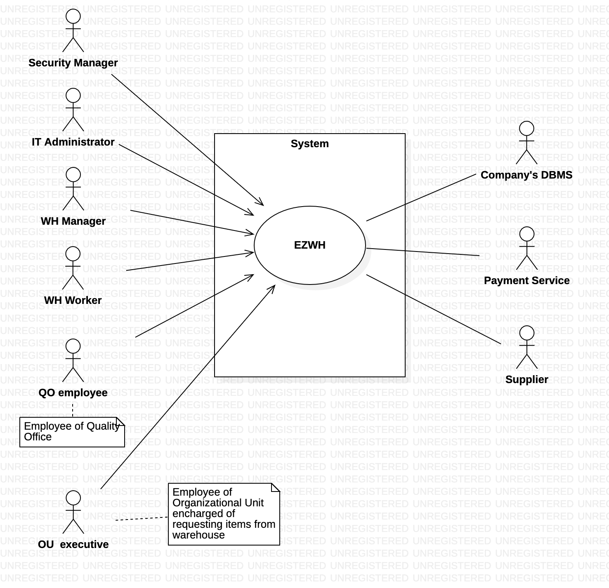

# Requirements Document 
Last-Modified: 31 march 2022
Date: 22 march 2022

Version: 0.2

 
| Version number | Change |
| ----------------- |:-----------|
| 0.1| added stakeholders |
| 0.2| context diagram, functional req|

# Contents

- [Informal description](#informal-description)
- [Stakeholders](#stakeholders)
- [Context Diagram and interfaces](#context-diagram-and-interfaces)
	+ [Context Diagram](#context-diagram)
	+ [Interfaces](#interfaces) 
	
- [Requirements Document](#requirements-document)
- [Contents](#contents)
- [Informal description](#informal-description)
- [Stakeholders](#stakeholders)
- [Context Diagram and interfaces](#context-diagram-and-interfaces)
  - [Context Diagram](#context-diagram)
  - [Interfaces](#interfaces)
- [Stories and personas](#stories-and-personas)
    - [A QO Employee](#a-qo-employee)
    - [A WH Worker](#a-wh-worker)
    - [A OU Executive](#a-ou-executive)
    - 
- [Functional and non functional requirements](#functional-and-non-functional-requirements)
  - [Functional Requirements](#functional-requirements)
  - [Non Functional Requirements](#non-functional-requirements)
- [Use case diagram and use cases](#use-case-diagram-and-use-cases)
  - [Use case diagram](#use-case-diagram)
    - [Use case 1, UC1](#use-case-1-uc1)
        - [Scenario 1.1](#scenario-11)
        - [Scenario 1.2](#scenario-12)
        - [Scenario 1.x](#scenario-1x)
    - [Use case 2, UC2](#use-case-2-uc2)
    - [Use case x, UCx](#use-case-x-ucx)
- [Glossary](#glossary)
- [System Design](#system-design)
- [Deployment Diagram](#deployment-diagram)

# Informal description

Medium companies and retailers need a simple application to manage the relationship with suppliers and the inventory of physical items stocked in a physical warehouse. 
The warehouse is supervised by a manager, who supervises the availability of items. When a certain item is in short supply, the manager issues an order to a supplier. In general the same item can be purchased by many suppliers. The warehouse keeps a list of possible suppliers per item. 

After some time the items ordered to a supplier are received. The items must be quality checked and stored in specific positions in the warehouse. The quality check is performed by specific roles (quality office), who apply specific tests for item (different items are tested differently). Possibly the tests are not made at all, or made randomly on some of the items received. If an item does not pass a quality test it may be rejected and sent back to the supplier. 

Storage of items in the warehouse must take into account the availability of physical space in the warehouse. Further the position of items must be traced to guide later recollection of them.

The warehouse is part of a company. Other organizational units (OU) of the company may ask for items in the warehouse. This is implemented via internal orders, received by the warehouse. Upon reception of an internal order the warehouse must collect the requested item(s), prepare them and deliver them to a pick up area. When the item is collected by the other OU the internal order is completed. 

EZWH (EaSy WareHouse) is a software application to support the management of a warehouse.

# Stakeholders

| Stakeholder name    | Description | 
| ------------------  | ------------|
| Company             | Takes business decisions regarding the use of the application |
| Organizational Unit | Requests internal orders by means of the application |
| OU executive        | employee of OU who personally request internal orders |
| Warehouse manager   | Supervises the availability of items and issues orders to suppliers | 
| Warehouse worker    | Deals with physical items in the warehouse |
| Quality office      | In charge of quality testing on new arrived items |
| Supplier            | Provides items to the warehouse  |
| Software house      | Develops, updates and maintains the software system |
| IT administrator    | Manages daily functioning of the application |
| Security manager    | Supervises the security of the system |
| DB manager          | In charge of the DBMS |
| DBMS                | DataBase Management System used by the company |
| Payment Service     | Manages payments to suppliers |
| Shipping company    | In charge of delivering items |

# Context Diagram and interfaces

## Context Diagram
\<Define here Context diagram using UML use case diagram>

\<actors are a subset of stakeholders>

## Interfaces
\<describe here each interface in the context diagram>

\<GUIs will be described graphically in a separate document>

| Actor               | Logical Interface| Physical Interface          |
| ------------------- |:----------------:| ---------------------------:|
|   WH Manager        | GUI              | Screen, Keyboard            |
|   WH Worker         | GUI, ReadBarCode | Screen, Buttons, Laser Beam |
|   QO Employee       | GUI              | Screen, Keyboard            |
|   OU Executive      | GUI              | Screen, Keyboard            |
|   Security Manager  | GUI              | Screen, Keyboard            |
|   IT Administrator  | GUI              | Screen, Keyboard            |
|   Payment Service   | Data             | Internet Connection         |
|   Company's DBMS    | Data             | Network Connection          | 
|   Supplier          | GUI              | Screen, Keyboard            |   
# Stories and personas
### A QO Employee
They might receive an Item from a Supplier and, after ensuring its quality, have to check it in into EZWH. They might spot a defective item and promptly mark it our with their app. (?)
### A WH Worker
They will move our inventory when necessary, scanning each code with their reader and getting their instructions from a mobile screen (tablet?).
### A OU Executive
They might need a specific item and request it on the company's intranet.
### 
\<A Persona is a realistic impersonation of an actor. Define here a few personas and describe in plain text how a persona interacts with the system>

\<Persona is-an-instance-of actor>

\<stories will be formalized later as scenarios in use cases>

# Functional and non functional requirements

## Functional Requirements

\<In the form DO SOMETHING, or VERB NOUN, describe high level capabilities of the system>

\<they match to high level use cases>

| ID        | Description  |
| ------------- |:-------------:| 
|  FR1     | Identify Items |
|  FR2     | Assure Quality |
|  FR2     | Manage  |
|  FR2     | Track warehouse inventory  |
| **FR1**  | Manage users|
| FR1.1  | Add user|
| FR1.2 | Edit user|
| FR1.3  | Delete user|
| **FR2**  | Manage suppliers|  
| FR2.1  | Add supplier|  
| FR2.2  | Edit supplier|  
| FR2.3  | Delete supplier|  
| FRx..  | Alert Stakeholders | 
| FRx..  | Notify lack of items' avaibility | 
| **FR3**  | Handle orders to supplier |
| FR3.1  | Check free space per item|
| FR3.2  | Find possible suppliers per item | 
| FR3.3  | Issue order to a supplier |
| FR3.4  | Notify payment service about the transaction    |  
| FR3.5  | Track order status  |
| **FR4**  | Manage items after delivery  |
| FR4.1  | Change order status |
| FR4.2  | Insert report of quality check | 
| FR4.3  | Accept or refuse external order|
| FR4.4  | Notify supplier about outcome of quality check | 
| FR4.5  | Suggest position for new item|
| **FR5**   | Get items position |
| FR5.1      | Get items position by id |
| FR5.2      | Get items position by type |
|**FR6**  | Show list of items|
| FR6.1   | filter items by type|
| **FR7**     | Authentication|
| FR7.1   | Login|
| FR7.2   | Logout|

## Non Functional Requirements

\<Describe constraints on functional requirements>

| ID        | Type (efficiency, reliability, ..)           | Description  | Refers to |
| ------------- |:-------------:| :-----:| -----:|
|  NFR1     |   |  | |
|  NFR2     | |  | |
|  NFR3     | | | |
| NFRx .. | | | | 

# Use case diagram and use cases

## Use case diagram
\<define here UML Use case diagram UCD summarizing all use cases, and their relationships>

\<next describe here each use case in the UCD>
### Use case 1, UC1
| Actors Involved        |  |
| ------------- |:-------------:| 
|  Precondition     | \<Boolean expression, must evaluate to true before the UC can start> |
|  Post condition     | \<Boolean expression, must evaluate to true after UC is finished> |
|  Nominal Scenario     | \<Textual description of actions executed by the UC> |
|  Variants     | \<other normal executions> |
|  Exceptions     | \<exceptions, errors > |

##### Scenario 1.1 

\<describe here scenarios instances of UC1>

\<a scenario is a sequence of steps that corresponds to a particular execution of one use case>

\<a scenario is a more formal description of a story>

\<only relevant scenarios should be described>

| Scenario 1.1 | |
| ------------- |:-------------:| 
|  Precondition     | \<Boolean expression, must evaluate to true before the scenario can start> |
|  Post condition     | \<Boolean expression, must evaluate to true after scenario is finished> |
| Step#        | Description  |
|  1     |  |  
|  2     |  |
|  ...     |  |

##### Scenario 1.2

##### Scenario 1.x

### Use case 2, UC2
..

### Use case x, UCx
..

# Glossary

\<use UML class diagram to define important terms, or concepts in the domain of the system, and their relationships> 

\<concepts are used consistently all over the document, ex in use cases, requirements etc>

# System Design
\<describe here system design>

\<must be consistent with Context diagram>

# Deployment Diagram 

\<describe here deployment diagram >

