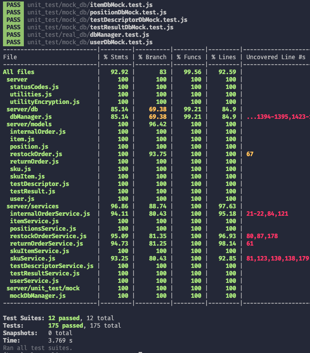

# Unit Testing Report

Last-modified date: 20/06/2022

Version: 1.2

Date: 04 May 2022

| Change | Description     |
| ------ | --------------- |
| 1.1    | change 1        |
| 1.0    | initial release |

# Contents

- [Black Box Unit Tests](#black-box-unit-tests)

- [White Box Unit Tests](#white-box-unit-tests)

# Black Box Unit Tests

Because of complexity of the system, we have decided to test only some of the most significant functions through Black Box Unit Testing. In this section we will test the following functions of DbManager (dao):
  

  - getUser(username, type)
  - updatePosition(oldPositionId, newPosition)
  - deleteTestDescriptor(id)
  - storeRestockOrderSku(id, products)
  - storeInternalOrder(io)

 ### **Class DbManager - method getUser(username, type)**

**Criteria for method getUser(username, type):**
	

 - username is string
 - type is string
 - User with the given username exists in the database

**Predicates for method getUser(username, type):**

| Criteria           | Predicate |
| ------------------ | :-------: |
| username is string |    yes    |
|                    |    not    |
| type is string     |    yes    |
|                    |    not    |
| User exists        |    yes    |
|                    |    not    |

**Boundaries**:

| Criteria           | Boundary values |
| ------------------ | :-------------: |
| username is string |        0        |
| type is string     |        0        |
| User exists        |        0        |

**Combination of predicates**:

| username is string | type is string | username exists | Valid / Invalid | Description of the test case                                                   | Test case                            |
| :----------------: | :------------: | :-------------: | :-------------: | ------------------------------------------------------------------------------ | ------------------------------------ |
|        yes         |      yes       |       yes       |      Valid      | The parameters are correct and User exists, it will return an instance of User | getUser("username", "type1") -> User |
|        yes         |      yes       |       not       |     Invalid     | The parameters are in a correct form, but User doesn't exist                   | getUser("username", "type1") -> Null |
|        yes         |      not       |   yes or not    |     Invalid     | type is not defined, it will throw an error                                    | getUser("username", null) -> Error   |
|        not         |      yes       |   yes or not    |     Invalid     | username is not defined, it will throw an error                                | getUser(null, "type1) -> Error       |
|        not         |      not       |   yes or not    |     Invalid     | username and type are not defined, it will throw an error                      | getUser(null, null) -> Error         |

 ### **Class DbManager - method updatePosition(oldPositionId, newPosition)**

 **Criteria for method updatePosition(oldPositionId, newPosition):**
	

 - oldPositionId is a Well Formed Number (WFN) (see below)
 - newPosition is a Well Formed Position (WFP) (see below)
 - Position with id  oldPositionId exists in the database

*A Well Formed Number (WFN) is a Number or a String that can be converted correctly to a Number*

*A Well Formed Position (WFP) is an instance of Position in which attributes satisfy ALL the following constraints:*

| Attribute                     | Constraints    |
| ----------------------------- | -------------- |
| newPosition.positionId.length | === 12         |
| newPosition.aisle.length      | === 4          |
| newPosition.row.length        | === 4          |
| newPosition.col.length        | === 4          |
| newPosition.maxWeight         | 0 to maxDouble |
| newPosition.maxVolume         | 0 to maxDouble |
| newPosition.OccupiedWeight    | 0 to maxDouble |
| newPosition.OccupiedVolume    | 0 to maxDouble |

**Predicates for method updatePosition(oldPositionId, newPosition):**

| Criteria                              |     Predicate     |
| ------------------------------------- | :---------------: |
| oldPositionId is a WFN                |        yes        |
|                                       |        no         |
| newPosition is a WFP                  |        yes        |
|                                       |        no         |
| Position with id oldPositionId exists |        yes        |
|                                       |        no         |
| oldPositionId length                  |    equal to 12    |
|                                       | different than 12 |

**Boundaries**:

| Criteria                              | Boundary values |
| ------------------------------------- | :-------------: |
| oldPositionId is a WFN                |        0        |
| newPosition is a WFP                  |        0        |
| Position with id oldPositionId exists |        0        |
| oldPositionId length                  |     === 12      |
| type is string                        |        0        |
| username exists                       |        0        |

**Combination of predicates**:

| oldP is WFN | newP is WFP | Position exists | oldPositionId length | Valid / Invalid | Description of the test case                                     | Test case                                        |
| :---------: | :---------: | :-------------: | :------------------: | :-------------: | ---------------------------------------------------------------- | ------------------------------------------------ |
|     yes     |     yes     |       yes       |     equal to 12      |      Valid      | Parameters are correct and position exists                       | updatePosition("123456789012", newP1) -> true    |
|     yes     |     yes     |       not       |  different than 12   |      Valid      | If Id is different than 12, there is not a position with this id | updatePosition("123", newP1) -> false            |
|     yes     |     yes     |       not       |     equal to 12      |      Valid      | If position don't exist, no changes, return false                | updatePosition("123456789012", newP1) -> false   |
| yes or not  |     not     |   yes or not    |         any          |     Invalid     | If newP is not WFP, it will throw an error                       | updatePosition("123456789012", "newP2") -> Error |
|     not     |     yes     |   yes or not    |         any          |     Invalid     | If oldP is not WFN, no match in table of DB                      | updatePosition("abc", newP1) -> false            |

### **Class DbManager - method deleteTestDescriptor(id)**

 **Criteria for method deleteTestDescriptor(id):**
	
 - id is a Well Formed Number (WFN) (see below)
 - Test Descriptor with id exists in the database

*A Well Formed Number (WFN) is a Number or a String that can be converted correctly to a Number*

**Predicates for method deleteTestDescriptor(id):**

| Criteria                       | Predicate |
| ------------------------------ | --------- |
| id is a WFN                    | yes       |
|                                | no        |
| Test Descriptor with id exists | yes       |
|                                | no        |

**Boundaries**:

| Criteria                       | Boundary values |
| ------------------------------ | --------------- |
| is is a WFN                    | 0               |
| Test Descriptor with id exists | 0               |

**Combination of predicates**:

| id is a WFN | TestDescriptor exists | Valid / Invalid | Description of the test case                             | Test case                            |
| :---------: | :-------------------: | :-------------: | -------------------------------------------------------- | ------------------------------------ |
|     yes     |          yes          |      Valid      | Parameters are correct and Test Descriptor exists        | deleteTestDescriptor("123") -> true  |
|     yes     |          not          |     Invalid     | Parameters are correct but Test Descriptor doesn't exist | deleteTestDescriptor(123) -> false   |
|     not     |      yes or not       |     Invalid     | id is not a WFN, it will throw an error                  | deleteTestDescriptor("abc") -> Error |

 ### **Class DbManager - method storeRestockOrderSku(id, products)**

 **Criteria for method storeRestockOrderSku(id, products):**
	
 - id is a Well Formed Number (WFN) (see below)
 - products is a Well Formed Array of Products (WFP) (see below)

*A Well Formed Number (WFN) is a Number or a String that can be converted correctly to a Number*

*A Well Formed Array of Products (WFP) is an array of Products in which attributes of all of the items inside satisfy ALL the following constraints:*

| Attribute of Item | Constraints              |
| ----------------- | ------------------------ |
| SKUId             | is a String of 12 digits |
| itemId            | is a number              |
| description       | is a String              |
| price             | 0 to maxDouble           |
| qty               | 1 to maxInt              |

**Predicates for method storeRestockOrderSku(id, products):**

| Criteria        | Predicate |
| --------------- | :-------: |
| id is WFN       |    yes    |
|                 |    not    |
| products is WFP |    yes    |
|                 |    not    |

**Boundaries**:

| Criteria        | Boundary values |
| --------------- | :-------------: |
| id is WFN       |        0        |
| products is WFP |        0        |

**Combination of predicates**:

| id is WFN | products is WFP | Valid / Invalid | Description of the test case                         | Test case                                          |
| :-------: | :-------------: | :-------------: | ---------------------------------------------------- | -------------------------------------------------- |
|    yes    |       yes       |      Valid      | Parameters are correct                               | storeRestockOrderSku("123", goodProducts) -> true  |
|    yes    |       not       |     Invalid     | Products is not WFP, it will throw an error          | storeRestockOrderSku(123, badProducts) -> Error    |
|    not    |       yes       |     Invalid     | If id is not WFN, it will throw an error             | storeRestockOrderSku("abc", goodProducts) -> Error |
|    not    |       not       |     Invalid     | If parameters aren't correct, it will throw an error | storeRestockOrderSku("abc", badProducts) -> Error  |

 ### **Class DbManager - method storeInternalOrder(io)**

 **Criteria for method storeInternalOrder(io):**
	
 - io is an instance of InternalOrder
 - io.issueDate is a Well Formed DateTime(WFD)
 - io.customerId is a Well Formed Number (WFN)
 - io.state is a String

*A Well Formed Number (WFN) is a Number or a String that can be converted correctly to a Number*

**Predicates for method storeInternalOrder(io):**

| Criteria                           | Predicate |
| ---------------------------------- | :-------: |
| io is an instance of InternalOrder |    yes    |
|                                    |    not    |
| io.issueDate is a WFD              |    yes    |
|                                    |    not    |
| io.customerId is a WFN             |    yes    |
|                                    |    not    |
| io.state is a String               |    yes    |
|                                    |    not    |

**Boundaries**:

| Criteria                           | Boundary values |
| ---------------------------------- | :-------------: |
| io is an instance of InternalOrder |        0        |
| io.issueDate is a WFD              |        0        |
| io.customerId is a WFN             |        0        |
| io.state is a String               |        0        |

**Combination of predicates**:

| io is InternalOrder | io.issueDate is WFD | io.customerId is WFN | io.state is String | Valid / Invalid |         Description of the test case         |                Test case                |
| :-----------------: | :-----------------: | :------------------: | :----------------: | :-------------: | :------------------------------------------: | :-------------------------------------: |
|         yes         |         yes         |         yes          |        yes         |      Valid      |            Parameters are correct            | storeInternalOrder(io) -> InternalOrder |
|         yes         |     yes or not      |      yes or not      |        not         |     Invalid     |  State not String causes an error in the DB  |     storeInternalOrder(io) -> Error     |
|         yes         |     yes or not      |         not          |     yes or not     |     Invalid     | CustomerId not WFN causes an error in the DB |     storeInternalOrder(io) -> Error     |
|         yes         |         not         |      yes or not      |     yes or not     |     Invalid     | IssueDate not WFD causes an error in the DB  |     storeInternalOrder(io) -> Error     |
|         not         |         --          |          --          |         --         |     Invalid     |    io is not an instance of InternalOrder    |    storeInternalOrder(null) -> Error    |

# White Box Unit Tests

Unlike Black Box Unit Tests, in this section we tested the methods of the class DbManager and the methods of all the services classes with Jest.

Services are dependant on the DbManager class, so to test them we need to mock the DB in order to remove the dependency of the services.

Unit tests are divided in two folders:
- *code/server/unit_test/real_db*: contains the unit tests for the DbManager class applied to the real DB
- *code/server/unit_test/mock_db*: contains the unit tests for the services classe applied to the mock DB
- *code/server/unit_test/mock*: contains jest mock functions for the services classes

Services with real db will be tested during the API integration tests. 

#### UPDATE CHANGE 1:
Tests' implementation are changed to satisfy the change 1. Test's names have been kept the same as before for simplicity.

### Test cases definition

*Where is not specified, the test cases consider errors that functions could produce*

| Unit name             | Jest test group                                     | Jest test case                                |
| --------------------- | --------------------------------------------------- | --------------------------------------------- |
| DBManager             | [DB] restock orders GET functions                   | get all restock orders                        |
|                       |                                                     | get restock order in state: delivered         |
|                       |                                                     | get restock order by id                       |
|                       |                                                     | get sku of a restock order                    |
|                       |                                                     | get sku items of a restock order              |
|                       |                                                     | get return items of a restock order           |
|                       | [DB] restock orders CREATE UPDATE DELETE functions  | create restock order                          |
|                       |                                                     | add restock order sku                         |
|                       |                                                     | add sku items of a restock order              |
|                       |                                                     | update state of restock order                 |
|                       |                                                     | update transport note of restock order        |
|                       |                                                     | delete restock order sku items                |
|                       |                                                     | delete restock order sku                      |
|                       |                                                     | delete restock order                          |
|                       | [DB] restock model return checkers                  | get transport note as string                  |
|                       |                                                     | get correct skuItems according to state       |
|                       | [DB] return orders functions                        | get all return orders                         |
|                       |                                                     | get return order by id                        |
|                       |                                                     | get sku items of a return order               |
|                       |                                                     | store return order                            |
|                       |                                                     | add sku items to a return order               |
|                       |                                                     | delete return order sku items                 |
|                       |                                                     | delete return order                           |
|                       | [DB] internal orders GET functions                  | get all internal orders                       |
|                       |                                                     | get all internal orders                       |
|                       |                                                     | get internal order by id                      |
|                       |                                                     | get internal order sku                        |
|                       |                                                     | get internal order sku items                  |
|                       | [DB] internal orders CREATE UPDATE DELETE functions | store internal order                          |
|                       |                                                     | add internal order sku                        |
|                       |                                                     | add internal order sku items                  |
|                       |                                                     | update internal order                         |
|                       |                                                     | delete internal order sku items               |
|                       |                                                     | delete internal order sku                     |
|                       |                                                     | delete internal order                         |
|                       | [DB] test descriptor GET functions                  | get all test descriptors                      |
|                       |                                                     | get test descriptor by id                     |
|                       |                                                     | get test descriptor of a sku                  |
|                       | [DB] test descriptor CREATE UPDATE DELETE functions | create test descriptor                        |
|                       |                                                     | update test descriptor                        |
|                       |                                                     | delete test descriptor                        |
|                       | [DB] test result GET functions                      | get all test result of a skuItem              |
|                       |                                                     | get test result by id  and rfid               |
|                       |                                                     | get negative test result of a skuItem         |
|                       | [DB] test result CREATE UPDATE DELETE functions     | create test result                            |
|                       |                                                     | update test result                            |
|                       |                                                     | delete test result                            |
|                       | [DB] user GET functions                             | get user by id and type                       |
|                       |                                                     | get user by username and type                 |
|                       |                                                     | get all users of type                         |
|                       |                                                     | get all users except managers                 |
|                       | [DB] user CREATE UPDATE DELETE functions            | create user                                   |
|                       |                                                     | update user                                   |
|                       |                                                     | delete user                                   |
|                       | [DB] position functions                             | get all positions                             |
|                       |                                                     | get position by id                            |
|                       |                                                     | store position                                |
|                       |                                                     | update position                               |
|                       |                                                     | delete position                               |
|                       | [DB] get occupied capacities of a position          | get occupied capacities of a position         |
|                       | [DB] sku functions                                  | get sku by id                                 |
|                       |                                                     | get all skus                                  |
|                       |                                                     | get sku of position                           |
|                       |                                                     | store sku                                     |
|                       |                                                     | update sku                                    |
|                       |                                                     | update position of sku                        |
|                       |                                                     | delete sku                                    |
|                       | [DB] SkuItems functions                             | get sku item by rfid                          |
|                       |                                                     | get all sku items                             |
|                       |                                                     | get sku item of sku                           |
|                       |                                                     | get available sku items of sku                |
|                       |                                                     | store sku item                                |
|                       |                                                     | update sku item                               |
|                       |                                                     | delete sku item                               |
|                       | [DB] Items functions                                | get all items test                            |
|                       |                                                     | get item by id                                |
|                       |                                                     | get item by sku id and supplier               |
|                       |                                                     | store item test                               |
|                       |                                                     | update item test                              |
|                       |                                                     | delete item test                              |
|                       | [DB] close db and testing functions                 | getPosition reject                            |
|                       |                                                     | storeInternalOrder reject                     |
|                       |                                                     | get all positions reject                      |
|                       |                                                     | delete position reject                        |
|                       |                                                     | get occupied capacity of position reject      |
|                       |                                                     | get sku by id reject                          |
|                       |                                                     | getSkuOfPosition reject                       |
|                       |                                                     | getAllSkuItems reject                         |
|                       |                                                     | getSkuItemByRfid reject                       |
|                       |                                                     | getSkuItemsOf reject                          |
|                       |                                                     | getAvailableSkuItemsOf reject                 |
|                       |                                                     | deleteSkuItem reject                          |
|                       |                                                     | getAllItems reject                            |
|                       |                                                     | getItemById reject                            |
|                       |                                                     | deleteItem reject                             |
| InternalOrderService  | get internal orders                                 | get all internal orders                       |
|                       |                                                     | get internal order                            |
|                       |                                                     | get issued internal orders                    |
|                       |                                                     | get accepted internal orders                  |
|                       | create edit delete internal orders                  | create internal order                         |
|                       |                                                     | update state of internal order                |
|                       |                                                     | update state and sku items of internal order  |
|                       |                                                     | delete internal order sku items               |
|                       | specific internal order errors                      | io not found during update                    |
|                       |                                                     | sku  not found during update                  |
| RestockOrderService   | get restock orders                                  | get restock order by id                       |
|                       |                                                     | get all restock orders                        |
|                       |                                                     | get issued restock orders                     |
|                       |                                                     | get return items by restock order             |
|                       | create restock order                                | add restock order                             |
|                       | update restock order                                | update state of restock order                 |
|                       |                                                     | update transport note of restock order        |
|                       |                                                     | update skuItems of restock order              |
|                       | delete restock order                                | delete restock order                          |
| ReturnOrderService    | get return orders                                   | get all return orders                         |
|                       |                                                     | get return order by id                        |
|                       | create return order                                 | add return order                              |
|                       |                                                     | error during storing return order             |
|                       |                                                     | error during storing products of return order |
|                       | delete return order                                 | delete return order                           |
| TestDescriptorService | get all test descriptors                            | get all test descriptors                      |
|                       | get test descriptor by id                           | get test descriptor by id                     |
|                       | create test descriptor                              | create test descriptor                        |
|                       | update test descriptor                              | update test descriptor                        |
|                       | delete test descriptor                              | delete test descriptor                        |
| TestResultService     | get test results of skuItem                         | get test results of skuItem                   |
|                       | get test result                                     | get test result                               |
|                       | create test result                                  | create test result                            |
|                       | update test result                                  | update test result                            |
|                       | delete test result                                  | delete test result                            |
| UserService           | get user info                                       | get user info                                 |
|                       | get all suppliers                                   | get all suppliers                             |
|                       | get all users                                       | get all users                                 |
|                       | create new user                                     | create new user                               |
|                       | login                                               | login                                         |
|                       | logout                                              | logout                                        |
|                       | update user rights                                  | update user rights                            |
|                       | delete user                                         | delete user                                   |
| SkuService            | get all sku                                         | get all sku                                   |
|                       | get sku by id                                       | get sku by id                                 |
|                       | create sku                                          | create sku                                    |
|                       | update sku                                          | update sku                                    |
|                       | update sku position                                 | update sku position                           |
|                       | delete sku                                          | delete sku                                    |
|                       | update sku forcing 503                              | update sku with errors                        |
| SkuItemService        | get all sku items                                   | get all sku items                             |
|                       | get sku items of skuid                              | get sku item of skuid                         |
|                       | get skuItem                                         | get skuItem                                   |
|                       | create skuItem                                      | create skuItem                                |
|                       | update skuItem                                      | update skuItem                                |
|                       | delete skuItem                                      | delete skuItem                                |
| PositionService       | get all positions                                   | get all positions                             |
|                       | create position                                     | create position                               |
|                       | update position                                     | update position                               |
|                       | update position id                                  | update position id                            |
|                       | delete position                                     | delete position                               |
| ItemService           | get all items                                       | get all items                                 |
|                       | get item by id                                      | get item by id                                |
|                       | create item                                         | create item                                   |
|                       | update item                                         | update item                                   |
|                       | delete item                                         | delete item                                   |

### Code coverage report

Note: dbManager has a lower % branch coverage because all queries are explicited, so it's difficult for the test to cover rejected queries. The idea is to force a reject and this is possible only closing the database connection. We did for some of the functions, but to cover all functions we would have to copy paste the test for each function.

#### UPDATE CHANGE 1
After change 1, the unit test coverage is:

### Loop coverage analysis
In our project there aren't significant loops so we didn't do a loop coverage analysis.